## Práctica Nro. 3-1: Web Application Analysis (Análisis de Vulnerabilidades en Servicios Web)

### Introducción

El profesor comenzó la práctica sobre como Los **servicios web** son fundamentalmente software, y por ende es **vulnerable por defecto**. Cuando un servidor web proporciona servicio a otras aplicaciones, **se expande la superficie de ataque**, creando más puntos de entrada potenciales para un atacante al ahora estar dos software como objetivos potenciales para un atacante.

Es importante distinguir entre **ancho de banda** (capacidad del medio) y **throughput** (rendimiento efectivo real). Usar los términos correctamente es fundamental para evaluar correctamente el sistema.

Finalmente, cuando analizamos vulnerabilidades, **se actualiza con vista al pasado, no se puede predecir el futuro**. Las herramientas identifican vulnerabilidades conocidas y patrones documentados. Por eso usamos la **disponibilidad de información actualizada**, no predicciones.

---

**Requisitos:**
* OWASP ZAP software instalado en la VM de Kali Linux
* PentesterLab (Objetivo de análisis)
* Acceso a Internet

***

## Parte I: Uso Básico de OWASP ZAP (Safe Mode)

1.  **Inicio de la VM y Conectividad:**
    * Se incició la máquina virtual Kali denominada como "Analista", quuine sera la encargada de usr las herramientas para realizar el análidid de las vulnerabilidades de los servicios web a analizar.
    * Se verificó el acceso a Internet desde la máquina "Analista" mediante el uso del comando ping -c4 a la dirección IP 8.8.8.8 correspondiente a Google y como se observa en la imagen debajo de este párrafo se enviaron todos los paquetes y se recibió una respuesta afirmativa a cada de uno de ellos. Cabe recordar que la bandera -c y su argumento posterior indica la cantidad de paquetes ICMP usadas para testear la conexión y que el TTL observado corresponde a la máquina Windows donde se está ejecutando la VM ya que para realizar el proceso se usan las interfaces de red de la máquina física y por ello el TTL observado es de 114(el TTL estándar de los SO Windows es de 128).

    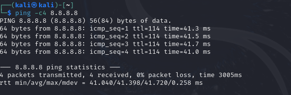

2.  **Instalación y Configuración:**
    * Como se puede ver en la imágen posterior no se pudo conectar al escritorio remoto de la máquina del profesor(IP 192.168.4.36/24) para importar el archivo del instalador de OWASP ZAP ya que en la máquina física el archivo no estaba en la carpeta denominada como "Ciberseguridad" por lo que se tuvo que importar mediante un dispositivo USB copiando el archivo de otra máquina.
    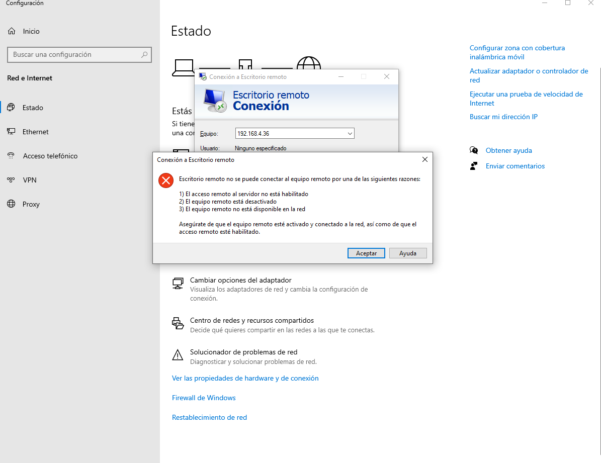
    * Se arrastró y soltó el instalador (`ZAP_2_16_1_unix.sh` o similar) a la VM de Kali, este archivo es el correspondiente a OWAS ZAP, la herramienta que será utilizada en esta práctica para hacer los análisis de las vulnerabilidades de los servicios web.
    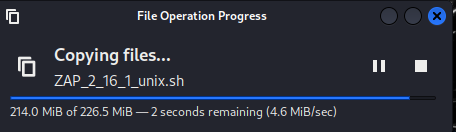
    * Se instaló OWASP ZAP con los siguientes comandos (adaptados a la versión disponible):
        * `chmod o+x ZAP_2_12_0_unix.sh`
        * `./ ZAP_2_12_0_unix.sh`
    
       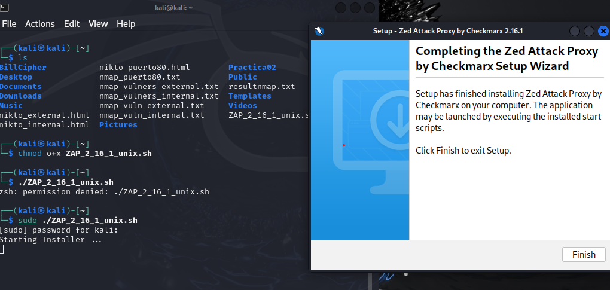

    * El primer comanndo ejecutado tiene como finalidad darle permiso de ejecución a otros usuarios que no sean ni el propietario ni que pertenezcan al grupo del cual es miembro el archivo al script ./ ZAP_2_12_0_unix.sh, este cambio de permisos se logra con chmod(change mode) y sus banderas para especificar el cambio. En este caso se están activando las banderas o y +x, la primera(o) se encarga de darle permiso sobre el archivo a los usuarios que no son ni el propietario ni miembros del grupo al cual pertenece al archivo mientras que la segunda(+x) se encarga de asignar el permiso de ejecución sobre el archivo.
    * El segundo comando es la ejecución del archivo, en este caso el instalador de OWASP ZAP y cómo se ejecutó el change mode no es necesario usar sudo para ejectuar el archivo al ya tener los demás usuarios del sistema el permiso para ejecutarlo. El ./ se usa para indicar que se va a ejecutar un archivo que está dentro del directorio actual.
       
    * Se configuró el proxy en el navegador a **127.0.0.1** y puerto **8080**, se usa especificamente esta dirección IP ya que es la dirección IP de loopback lo que significa que le estamos diciendo al navegador que el proxy se está ejecutando en la misma máquina por la cual se está navegando, no en una máquina aparte y se usa el puerto 8080 ya que OWASP ZAP está configurado para escuchar el tráfico de ese puerto. Con esta configuración se está especificando que el proxy sea OWASP ZAP por lo que todas las peticiones HTTP y HTTPS tanto como request como response pasarán por él antes de llegar sus respectivos destions(la VM o el servidor web dependiendo del caso).
    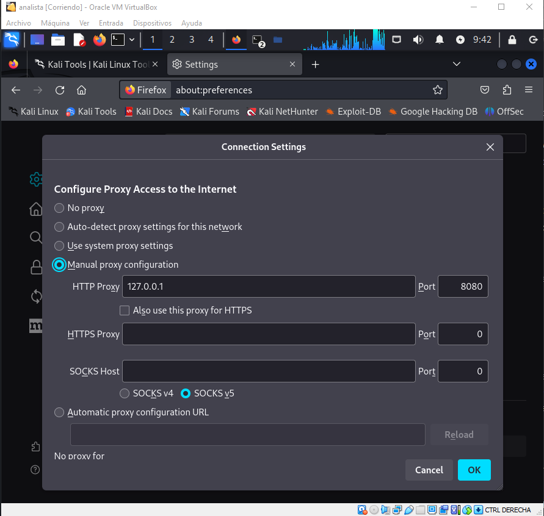
    * Al abrir OWASP ZAP, se escogió **“No, I do not want to persist this session at this moment in time”** (no deseo sesión persistente) lo que hace que los datos obtenidos por la herramienta sea guardados en la memoria RAM ganando una mayor velocidad de acceso a los datos por parte de ZAP pero con la desventaja de perder los datos obtenidos al apagar la máquina al la RAM usar almacenamiento volátil.
    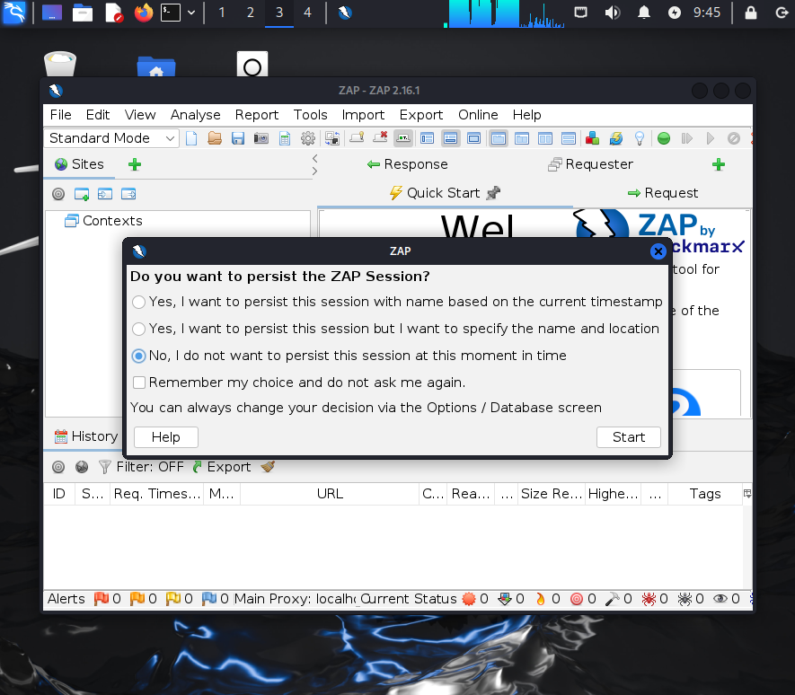
    
3.  **Configuración de Confianza (Certificado):**
    * Se importó el Certificado de Entidad (CE) de OWASP ZAP en el navegador Mozilla para crear la confianza (vía *Tools / Options / Network / Server Certificates / Save* y luego *Setting / View Certificate / Import*).
    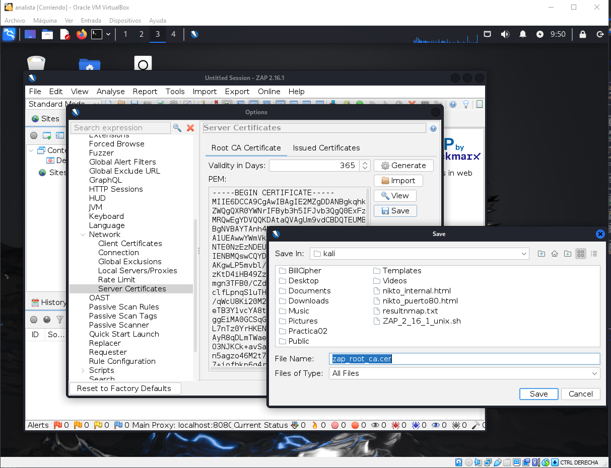
    
4.  **Análisis Inicial:**
    * Se seleccionó **“Safe Mode”**.
    * Se navegó en el objetivo sugerido (PentesterLab) y se observó el intercambio de mensajes en OWASP ZAP.
    
    * Se identificaron las alertas generadas por la navegación pasiva.
    
***

## Parte II: Escaneo Automatizado (Standard Mode)

1.  **Preparación del Escaneo:**
    * Se seleccionó el **“Standard Mode”**.
    * Se hizo clic en **“Automated Scan”**.
    * Se llenó el campo **URL** con la dirección IP de la VM de PentesterLab y se presionó **"Attack"**.
    
2.  **Ejecución y Resultados:**
    * *Observación*: Este método es el más simple, pero no el más recomendado debido a que el escaneo activo implica inyección y podría ser detectado por equipos de seguridad del servicio Hosting.
    * Una vez culminado el *Spider*, se detuvo la ejecución (si es necesario) y se observaron los resultados.
    * Se verificó el resultado de las **Alertas** luego de continuar con el escaneo activo.
    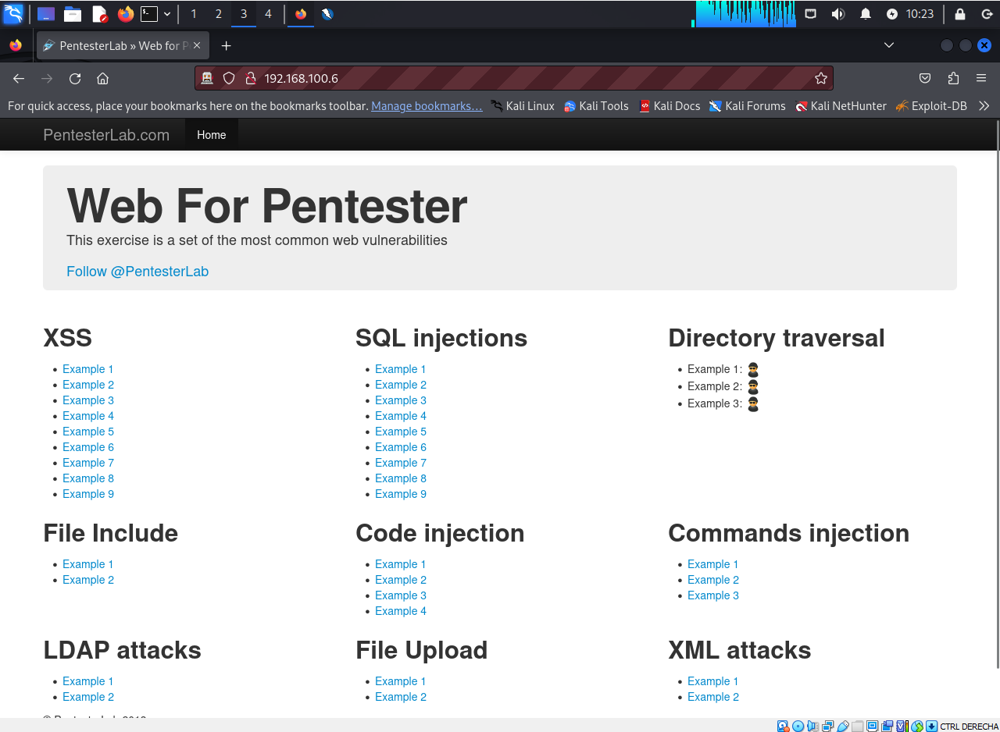
***

## Evidencias de Comandos y Aplicaciones

Se investigó en Internet y/o se usó la documentación de OWASP ZAP para obtener el título, la descripción y la sugerencia de solución (explicada con palabras propias) de tres alertas con riesgo **alto** o **medio**.

### 1. Alerta de Riesgo Alto/Medio (Ejemplo)

| Título de la Alerta | Descripción (en español) | Sugerencia de Solución |
| :--- | :--- | :--- |
| **X-Frame-Options Header Not Set (1930)** | Esta alerta de riesgo **Medio** indica que el encabezado HTTP de seguridad **`X-Frame-Options`** no fue detectado en la respuesta del servidor. Esto hace que la página sea vulnerable a ataques de **Clickjacking**, donde un atacante puede cargar el sitio dentro de un *frame* invisible en su propio sitio malicioso para engañar al usuario y que realice acciones no deseadas. | El desarrollador debe configurar este encabezado HTTP para indicar si se permite a navegadores incrustar la página en elementos como `<iframe>`. Se recomienda usar **`X-Frame-Options: DENY`** para prevenir completamente la incrustación, o **`X-Frame-Options: SAMEORIGIN`** si la página solo debe poder ser incrustada por páginas del mismo origen. Una alternativa moderna es el uso de la directiva **`frame-ancestors`** en el *Content Security Policy* (CSP). |
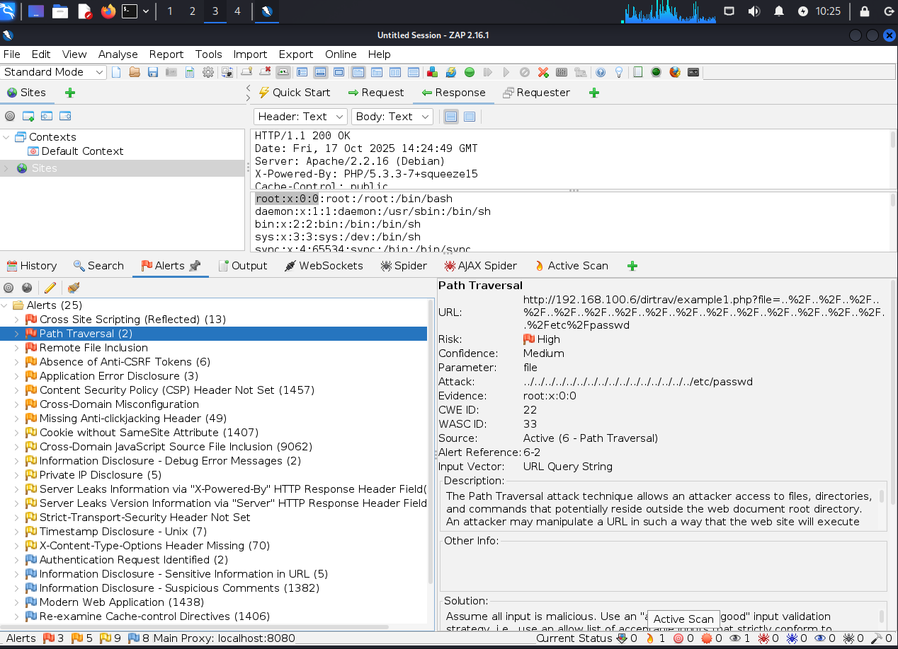
### 2. Alerta de Riesgo Alto/Medio (Ejemplo)
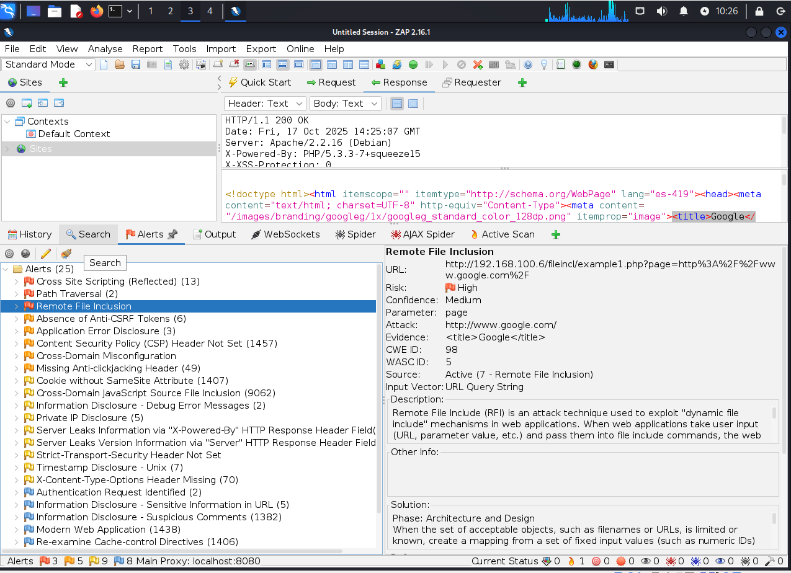
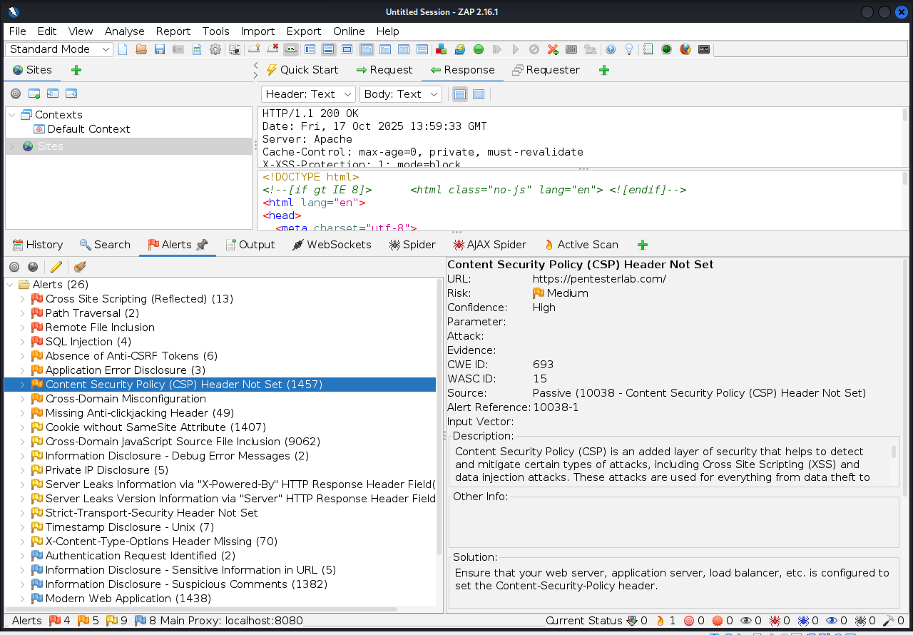
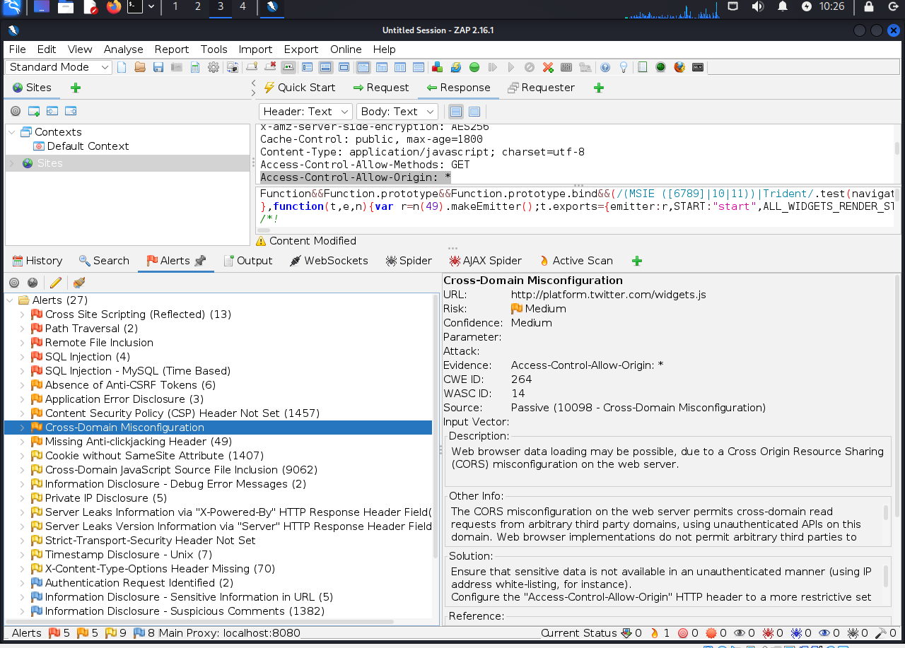
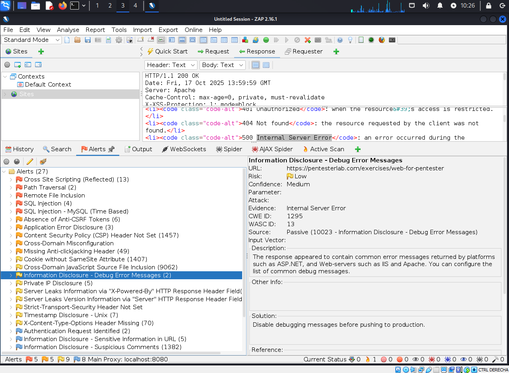
| Título de la Alerta | Descripción (en español) | Sugerencia de Solución |
| :--- | :--- | :--- |
| **Absence of Anti-CSRF Tokens (1308)** | Esta alerta de riesgo **Alto/Medio** señala que la aplicación web no está implementando **tokens Anti-Cross-Site Request Forgery** (Anti-CSRF) en las solicitudes que modifican el estado (e.g., *POST*, *PUT*). Sin estos *tokens*, un atacante puede inducir a un usuario autenticado a realizar acciones no intencionadas en el sitio (ataque CSRF) a través de un sitio de terceros. | Se debe implementar un **token criptográfico único** para cada sesión de usuario en peticiones sensibles. El *token* debe ser generado en el servidor, incluido en el formulario (como campo oculto) o encabezado HTTP, y validado por el servidor antes de procesar la solicitud. Esto asegura que solo las solicitudes originadas por la aplicación legítima del usuario sean aceptadas. |

### 3. Alerta de Riesgo Alto/Medio (Ejemplo)

| Título de la Alerta | Descripción (en español) | Sugerencia de Solución |
| :--- | :--- | :--- |
| **Cookie No HttpOnly Flag (13)** | Esta alerta de riesgo **Medio** indica que una o más *cookies* no tienen el atributo **`HttpOnly`** establecido. Si el sitio es vulnerable a **Cross-Site Scripting (XSS)**, un atacante podría usar código JavaScript malicioso para acceder y robar el valor de estas *cookies* (incluyendo *cookies* de sesión) y secuestrar la sesión del usuario. | Las *cookies* que no requieren ser leídas por *scripts* del lado del cliente (especialmente la *cookie* de sesión) deben ser configuradas con el *flag* **`HttpOnly`** en la respuesta HTTP `Set-Cookie`. Esta configuración evita que los *scripts* de cliente accedan a la *cookie*, mitigando el riesgo de robo de sesión a través de ataques XSS. |

***

## Reporte y Análisis Final

1.  **Generación de Reporte:**
    * Se generó un reporte en formato **HTML** del resultado completo del escaneo de la página.
2.  **Análisis y Explicación de las Alertas:**
    * El reporte HTML contiene una lista exhaustiva de las vulnerabilidades encontradas, clasificadas por nivel de riesgo (Alto, Medio, Bajo).
    * Las alertas de riesgo **Alto** (como problemas de inyección o fallos críticos de autenticación/autorización, si se encontraron) exigen la máxima prioridad de corrección, ya que su explotación puede llevar a un compromiso total de datos o del sistema.
    * Las alertas de riesgo **Medio** (como la falta de encabezados de seguridad o *cookies* sin *HttpOnly*) deben abordarse rápidamente para mejorar la postura general de seguridad y defenderse contra ataques comunes de *phishing* o *Clickjacking*.
    * El análisis confirma la importancia de las herramientas como OWASP ZAP para **identificar configuraciones inseguras y vulnerabilidades conocidas** de forma automática antes de que sean explotadas en un entorno de producción.

***

**Entrega de la Práctica:**

* Ficha de práctica completada (este documento).
* Archivo HTML del reporte generado por OWASP ZAP.