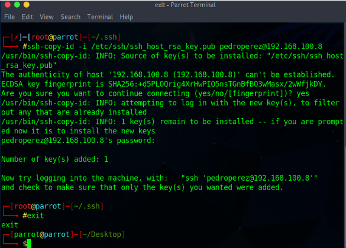

# Práctica Nro. 7: Password Attacks

## Datos de Identificación

| Apellido, Nombre | Cédula de Identidad | Nro. de Práctica | Fecha |
| :--- | :---: | :---: | :--- |
| Gil, Jesús | 30175126 | 7 | 07-11-2025|
| Guilarte, Andrés | 30246084 | 7 | 07-11-2025 |

**Grupo:** 4
_______________________________________

## Direccionamiento IP/Máscara:

 **Equipo origen/fuente:**
 **Equipo Objetivo/Destino:**
 **Otros Equipos involucrados:**

_______________________________________

## Preámbulo de la práctica

Al inicio de la práctica pasamos un repaso de criptografía: distinguimos criptografía simétrica (una misma clave para cifrar y descifrar, eficiente pero con el problema del intercambio seguro de la clave) y asimétrica (par de claves pública/privada, útil para intercambio seguro y firmas).

Se clarificó la diferencia entre cifrado y firma digital: el cifrado garantiza confidencialidad (que sólo el destinatario pueda leer el mensaje) mientras que la firma digital asegura autenticidad e integridad (que el mensaje proviene del remitente y no fue alterado).

Resumen de flujos con claves asimétricas:

- Cifrado (confidencialidad): el emisor cifra con la llave pública del receptor; el receptor descifra con su llave privada.
- Firma digital (autenticidad): el emisor firma (normalmente sobre un hash) con su llave privada; el receptor verifica la firma con la llave pública del emisor.

Combinación práctica: para lograr confidencialidad y autenticidad a la vez, el emisor firma el mensaje con su privada y luego cifra el mensaje firmado con la pública del receptor; el receptor descifra con su privada y verifica la firma con la pública del emisor.

Buenas prácticas breves: proteger claves privadas, usar algoritmos y tamaños actuales (p. ej. AES-256, RSA 3072+/ECC), y verificar certificados/cadena de confianza al usar llaves públicas.

### Software y herramientas necesarias

- CUPP (Common User Passwords Profiler) — descargar desde el repositorio Git oficial.  
- Hydra — herramienta de fuerza bruta (disponible en distribuciones de auditoría como Parrot).  
- Ncrack — herramienta de auditoría de servicios de red (disponible en repositorios).

### Infraestructura de máquinas virtuales

- Máquina Virtual A (Víctima): Kali Linux — servicio SSH habilitado.  
- Máquina Virtual B (Atacante): Parrot OS.  
- Conectividad: acceso a Internet y red entre VMs (configuración NAT o bridge según corresponda) para permitir comunicación entre ambas.

Nota breve para reejecución: conservar snapshots de las VMs, registrar direcciones IP y credenciales de prueba, y verificar que los servicios necesarios (p. ej. SSH) estén activos antes de iniciar la práctica.

_______________________________________

## Ejecución de la práctica

En esta sección se detallan los pasos prácticos para preparar y ejecutar la fase de generación de diccionarios con CUPP y su verificación. Todo lo siguiente debe ejecutarse en el Equipo B (Parrot OS) y únicamente contra objetivos de prueba autorizados.

### Preparación del entorno

- Asegúrese de tener instalado git y Python 3 en Parrot OS.
- Trabaje desde el escritorio del usuario para seguir los ejemplos (ruta: `~/Desktop`).

### Instalación de CUPP

Pasos básicos:

```bash
# Desde el directorio Desktop
cd ~/Desktop
git clone https://github.com/Mebus/cupp.git
cd cupp
chmod +x cupp.py
```

Explicación: el repositorio oficial de CUPP contiene el script `cupp.py` que genera diccionarios personalizados a partir de datos sociales del objetivo. El `chmod +x` permite ejecutarlo directamente.

### Generación de un diccionario personalizado (ejemplo)

Objetivo del ejercicio: usar CUPP para generar un diccionario basado en información pública/recopilada del usuario objetivo. A continuación se muestra un perfil de ejemplo y el flujo interactivo simplificado.

Perfil de Usuario Objetivo (Ejemplo)

- Nombre completo: Pedro Pablo Pérez Uzcategui
- Puesto: Analista de administración en "Confianza y Seguridad C.A" (RIF: J-00205070-2)
- Familia: casado con María De La Concepción; hijos Eva y Adam
- Mascota: Punky
- Aficiones: tenis, pesca, lectura
- Película favorita: Troya
- Color preferido: azul
- Vehículo: Ford Focus, placas MOG-2020
- Fechas: Nacimiento 24/12/1948; fechas familiares 14/02/1954, 18/02/1976, 14/09/1987
- Residencia: Caracas, Parroquia El Recreo, Edif. Parque Monte Verde, Piso 7, Apt. 702

Extracción de datos clave (variables)

- Nombres: Pedro, Pablo, Pérez, Uzcategui, María, Concepción, Eva, Adam, Rosa
- Lugares: Caracas, Recreo, MonteVerde, SanPedro, Altos
- Fechas y fragmentos: 24, 12, 1948, 14, 02, 1954, 18, 76, 09, 87
- Otros términos: Punky, Troya, azul, Ford, Focus, MOG2020, seguros, Confianza

Proceso interactivo (ejemplo simplificado)

```bash
python3 cupp.py -i
```

Entrada de ejemplo en el asistente interactivo (respuestas mostradas después de cada prompt):

```bash
> Name: pedro
> Surname: perez
> Nickname:
> Birthdate (DDMMYYYY):
> Partners name:
> Partners nickname:
> Partners birthdate (DDMMYYYY):
> Child's name:
> Child's nickname:
> Child's birthdate (DDMMYYYY):
> Pet's name: Punky
> Company name:
> Do you want to add some key words about the victim? Y/[N]: y
> Please enter the words, separated by comma: Pedro,Perez,Punky
> Do you want to add special chars at the end of words? Y/[N]: N
> Do you want to add some random numbers at the end of words? Y/[N]: N
> Leet mode? (i.e. leet = 1337) Y/[N]: N
```

Salida esperada (resumen):

```bash
[+] Now making a dictionary...
[+] Sorting list and removing duplicates...
[+] Saving dictionary to pedro.txt, counting 240924 words.
[+] Now load your pistolero with pedro.txt and shoot! Good luck!
```

Notas importantes sobre la generación

- CUPP genera muchas combinaciones; el tamaño final depende de las palabras clave y las opciones seleccionadas.
- Para ejercicios académicos use siempre datos ficticios o cuentas/servicios de prueba.
- Si necesita reducir el tamaño del diccionario, limite palabras clave, desactive leet y no añada sufijos numéricos.

### Verificación y uso del diccionario

Comando para inspeccionar el diccionario generado:

```bash
cat ~/Desktop/cupp/pedro.txt | wc -l
# o para listar las primeras líneas
head -n 30 ~/Desktop/cupp/pedro.txt
```

Análisis rápido:

- Total de contraseñas (líneas del fichero): aprox. 240,924 según el ejemplo.
- Contenido: combinaciones derivadas de nombres, apellidos, lugares y fechas; variaciones de mayúsculas/minúsculas según opciones.

Uso responsable (ejemplo): utilice `hydra` o `john` para pruebas autorizadas contra servicios de laboratorio. Ejemplo de sintaxis (solo en entorno controlado):

```bash
# Ejemplo ilustrativo (no ejecutar contra sistemas no autorizados)
# hydra -l usuario_prueba -P ~/Desktop/cupp/pedro.txt ssh://192.168.x.y
```

### Resultados obtenidos

El archivo generado por CUPP con las posibles contraseñas basadas en la información personal se encuentra en el siguiente enlace:

[gist al diccionario generado](https://gist.github.com/jesusgil26/83b68690308a297dbfd43d8df08c8bdd)   

Resumen de resultados:

- Fichero: pedro.txt (contenido publicado en el gist).
- Total de entradas: ~9604 (según conteo de lineas en el gist).
- Observaciones: el fichero contiene muchas variaciones (nombres, apellidos, combinaciones con fechas y sufijos); CUPP elimina duplicados, pero es habitual que queden entradas muy sencillas o comunes que conviene filtrar antes de usar en ataques de pruebas.

Cómo descargar el archivo desde el Gist (opcional):

```bash
# Abra la URL en un navegador y use el botón "Raw" para descargar el archivo directamente, o clonelo con ssh git@gist.github.com:83b68690308a297dbfd43d8df08c8bdd.git
```

Nota: el enlace apunta al Gist público del repositorio del alumno; al descargar y usar el diccionario recuerde aplicar las medidas de seguridad y sólo emplearlo en entornos de laboratorio autorizados.

_______________________________________

### Actividad 2 — Configuración SSH en el Equipo A (servicio y acceso)

Nota: esta actividad se debe ejecutar en el EQUIPO A y con privilegios (usar `sudo` cuando sea necesario). Todas las acciones descritas a continuación deben realizarse únicamente en entornos de laboratorio autorizados.

#### Iniciar el servicio SSH (como root o con sudo):

```bash
sudo service ssh start
```

#### Crear un usuario para acceso SSH (usuario: `pedroperez`):

```bash
sudo adduser pedroperez
# Cuando se solicite la contraseña, use: Punky_
# Deje todos los campos de identificación en blanco (pulse Enter)
```

#### Probar conexión remota desde el Equipo B (comprobación básica)

- Desde Equipo B intente conectarse por contraseña (solo para verificar que el servicio y el usuario existen):

```bash
ssh pedroperez@X.X.X.X
# Reemplace X.X.X.X por la IP del Equipo A. Ingrese la contraseña Punky_ cuando sea solicitada.
```

#### Generar la llave RSA en Equipo B (cliente) — comando sencillo:

```bash
ssh-keygen -t rsa
# Recomendado: usar -b 4096 para mayor entropía, y especifique la ruta si no desea sobrescribir claves existentes.
```

#### Copiar la clave pública al Equipo A para permitir acceso por clave (método recomendado):

- Usando `ssh-copy-id` desde Equipo B (esto creará/actualizará `/home/pedroperez/.ssh/authorized_keys` en el Equipo A):

```bash
ssh-copy-id -i ~/.ssh/id_rsa.pub pedroperez@X.X.X.X
```

- Si por alguna razón debe copiar manualmente la clave, en el Equipo A cree el directorio `.ssh` en el home del usuario y ajuste permisos:

```bash
sudo mkdir -p /home/pedroperez/.ssh
sudo chmod 700 /home/pedroperez/.ssh
sudo chown pedroperez:pedroperez /home/pedroperez/.ssh
# Luego en Equipo B
# scp ~/.ssh/id_rsa.pub pedroperez@X.X.X.X:/tmp/id_rsa.pub
# En Equipo A (como root):
sudo mv /tmp/id_rsa.pub /home/pedroperez/.ssh/authorized_keys
sudo chown pedroperez:pedroperez /home/pedroperez/.ssh/authorized_keys
sudo chmod 600 /home/pedroperez/.ssh/authorized_keys
```

Nota sobre la instrucción provista originalmente: el uso de `/etc/ssh/ssh_host_rsa_key.pub` no es la práctica recomendada para autenticación de usuarios; ese archivo es la clave pública del host y no debe usarse como `authorized_keys` de un usuario. Aquí asumimos que el objetivo es permitir que `pedroperez` inicie sesión por clave pública, por lo que usamos `~/.ssh/id_rsa.pub` del cliente.

#### Verificar acceso por clave (desde el Equipo B):

```bash
ssh pedroperez@X.X.X.X
# Si la copia de la clave fue correcta, la conexión no pedirá contraseña.
```

#### Comprobaciones y permisos (en Equipo A):

- Asegúrese de que el servicio SSH está activo y escuchando:

```bash
sudo systemctl status ssh
# o
sudo ss -tlnp | grep sshd
```

- Verifique permisos de los ficheros `.ssh` y `authorized_keys` en `/home/pedroperez` (deben ser 700 para el directorio y 600 para el fichero, y pertenecer al usuario).



_______________________________________

### Actividad 3 — Ataque de fuerza bruta con Hydra

En esta actividad se demostrará cómo utilizar **Hydra**, una de las herramientas más populares para auditorías de contraseñas, para realizar un ataque de fuerza bruta contra el servicio SSH configurado en el Equipo A. El objetivo es verificar la efectividad del diccionario generado con CUPP y observar cómo se registran estos intentos de acceso en los logs del sistema.

⚠️ **Advertencia importante:** Esta actividad debe ejecutarse **únicamente en entornos de laboratorio controlados y autorizados**. Realizar ataques de fuerza bruta contra sistemas sin autorización explícita es ilegal y viola las leyes de ciberseguridad en la mayoría de los países.

_______________________________________

#### PASO 1: Ejecutar Hydra desde el Equipo B

**Hydra** es una herramienta de auditoría de seguridad que permite realizar ataques de fuerza bruta contra múltiples protocolos (SSH, FTP, HTTP, RDP, etc.). En este caso, la utilizaremos para intentar descubrir la contraseña del usuario `pedroperez` usando el diccionario `pedro.txt` generado previamente con CUPP.

**Ubicación de ejecución:** EQUIPO B (Parrot OS - atacante)

**Comando a ejecutar:**

```bash
hydra -l pedroperez -P pedro.txt ssh://172.31.230.4 -vV
```

**Explicación detallada de los parámetros:**

- `hydra`: Comando principal de la herramienta de fuerza bruta
- `-l pedroperez`: Especifica el **login** (nombre de usuario) objetivo. En este caso, atacamos la cuenta `pedroperez`
- `-P pedro.txt`: Especifica el archivo de **passwords** (diccionario) que contiene las posibles contraseñas a probar. Hydra probará cada línea del archivo como una contraseña potencial
- `ssh://172.31.230.4`: Define el **protocolo** (SSH) y la **dirección IP** del objetivo (Equipo A). Reemplace `172.31.230.4` con la IP real de su Equipo A
- `-vV`: Modo **verbose doble**. Muestra información detallada durante la ejecución:
  - `-v`: Muestra cada intento de login (útil para ver el progreso)
  - `-V`: Muestra también los pares usuario/contraseña que se están probando en tiempo real

**Contexto técnico:**

Hydra funciona mediante paralelización de conexiones. Por defecto, intenta hasta 16 conexiones simultáneas para acelerar el proceso. Para cada entrada del diccionario:

1. Establece una conexión SSH con el servidor
2. Intenta autenticarse con el usuario especificado y la contraseña actual
3. Si falla, cierra la conexión y prueba con la siguiente contraseña
4. Si tiene éxito, muestra el resultado y puede continuar buscando más credenciales (dependiendo de las opciones)

**Salida esperada durante la ejecución:**

Durante la ejecución, verá una salida similar a esta:

``` bash
Hydra v9.x (c) 2023 by van Hauser/THC - Please do not use in military or secret service organizations
Hydra (https://github.com/vanhauser-thc/thc-hydra)
[WARNING] Many SSH configurations limit the number of parallel tasks, it is recommended to reduce the tasks: use -t 4
[DATA] max 16 tasks per 1 server, overall 16 tasks, 9604 login tries (l:1/p:9604)
[DATA] attacking ssh://172.31.230.4:22/
[VERBOSE] Resolving addresses ... [VERBOSE] resolving done
[ATTEMPT] target 172.31.230.4 - login "pedroperez" - pass "pedro" - 1 of 9604 [child 0]
[ATTEMPT] target 172.31.230.4 - login "pedroperez" - pass "Pedro" - 2 of 9604 [child 1]
[ATTEMPT] target 172.31.230.4 - login "pedroperez" - pass "perez" - 3 of 9604 [child 2]
...
[22][ssh] host: 172.31.230.4   login: pedroperez   password: Punky_
[STATUS] attack finished for 172.31.230.4 (waiting for children to complete tests)
1 of 1 target successfully completed, 1 valid password found
```

**Interpretación de los resultados:**

- **Si encuentra la contraseña:** Hydra mostrará una línea como `[22][ssh] host: 172.31.230.4   login: pedroperez   password: Punky_`, indicando que la contraseña fue descubierta exitosamente
- **Tiempo de ejecución:** Depende del tamaño del diccionario, la velocidad de la red y las limitaciones del servidor SSH (algunos implementan delays después de intentos fallidos)
- **Posición en el diccionario:** Si la contraseña está al principio del diccionario, se encontrará rápidamente; si está al final, puede tomar considerable tiempo

**Nota sobre rendimiento:**

SSH tiene mecanismos de protección que ralentizan los ataques de fuerza bruta:

- **Rate limiting:** Limita el número de conexiones simultáneas
- **Login grace time:** Tiempo máximo para completar la autenticación
- **MaxAuthTries:** Número máximo de intentos de autenticación por conexión
- **Fail2ban/denyhosts:** Pueden bloquear IPs después de X intentos fallidos

Por esto, puede recibir advertencias como: `[WARNING] Many SSH configurations limit the number of parallel tasks, it is recommended to reduce the tasks: use -t 4`

**Recomendación:** Si Hydra parece lento o recibe errores de conexión, reduzca el número de tareas paralelas:

```bash
hydra -l pedroperez -P pedro.txt ssh://172.31.230.4 -t 4 -vV
```

El parámetro `-t 4` limita a 4 conexiones simultáneas, reduciendo la carga en el servidor objetivo.

_______________________________________

#### PASO 2: Esperar y observar el resultado

**Proceso durante la ejecución:**

1. **Inicio:** Hydra mostrará información sobre el número total de intentos a realizar
2. **Progreso:** Verá cada intento en tiempo real (gracias a `-vV`)
3. **Finalización:** El proceso terminará cuando:
   - Encuentre la contraseña correcta (si está en el diccionario)
   - Agote todas las combinaciones del diccionario sin éxito
   - Encuentre un error de conectividad o sea bloqueado por el servidor

**Tiempo estimado:**

- Diccionario de ~9,600 entradas
- Con 16 tareas paralelas: aproximadamente 10-20 minutos (dependiendo de la configuración del servidor)
- Con 4 tareas paralelas: aproximadamente 30-60 minutos

**Capturas recomendadas:**

Mientras espera, tome capturas de pantalla de:

- La salida de Hydra mostrando los intentos (líneas `[ATTEMPT]`)
- El momento en que encuentra la contraseña (línea `[22][ssh]`)
- Las estadísticas finales (`1 of 1 target successfully completed`)

**Resultado exitoso esperado:**

``` bash
[22][ssh] host: 172.31.230.4   login: pedroperez   password: Punky_
1 of 1 target successfully completed, 1 valid password found
Hydra (https://github.com/vanhauser-thc/thc-hydra) finished at 2025-11-08 14:35:22
```

Este resultado confirma que:

- ✅ El diccionario generado con CUPP contenía la contraseña real
- ✅ El servicio SSH era vulnerable a ataques de fuerza bruta
- ✅ No había mecanismos de protección activos (fail2ban, etc.)

_______________________________________

#### PASO 3: Visualizar los logs de SSH en el Equipo A

Mientras Hydra está ejecutándose (o después de finalizar), es fundamental analizar los registros del servidor SSH en el Equipo A para entender cómo se ven los ataques de fuerza bruta desde la perspectiva del sistema objetivo.

**Ubicación de ejecución:** EQUIPO A (Kali Linux - víctima)

**Comando para visualizar logs del servicio SSH:**

```bash
journalctl -u ssh
```

**Explicación del comando:**

- `journalctl`: Utilidad para consultar y visualizar logs del systemd journal (sistema de logging moderno en distribuciones Linux)
- `-u ssh`: Filtra los logs para mostrar **únicamente** las entradas relacionadas con la **unidad** (unit) `ssh.service`

**Alternativas para visualizar logs:**

Si `journalctl` no está disponible o prefiere métodos tradicionales:

```bash
# Ver logs de autenticación (incluye SSH, sudo, login, etc.)
sudo tail -f /var/log/auth.log

# Ver solo las últimas 100 líneas de logs SSH
sudo grep sshd /var/log/auth.log | tail -n 100

# Filtrar solo intentos fallidos
sudo grep "Failed password" /var/log/auth.log

# Filtrar intentos exitosos
sudo grep "Accepted password" /var/log/auth.log
```

**Comando recomendado para seguimiento en tiempo real:**

Si desea ver los logs mientras Hydra está ejecutándose en el Equipo B:

```bash
sudo journalctl -u ssh -f
```

El parámetro `-f` (follow) es similar a `tail -f`: muestra los nuevos logs en tiempo real a medida que se generan.

**Ejemplo de salida esperada en los logs:**

Verá múltiples entradas como estas:

``` bash
Nov 08 14:30:15 equipoA sshd[12345]: Failed password for pedroperez from 172.31.230.5 port 54321 ssh2
Nov 08 14:30:16 equipoA sshd[12346]: Failed password for pedroperez from 172.31.230.5 port 54322 ssh2
Nov 08 14:30:16 equipoA sshd[12347]: Failed password for pedroperez from 172.31.230.5 port 54323 ssh2
Nov 08 14:30:17 equipoA sshd[12348]: Failed password for pedroperez from 172.31.230.5 port 54324 ssh2
...
[múltiples intentos fallidos]
...
Nov 08 14:35:22 equipoA sshd[12567]: Accepted password for pedroperez from 172.31.230.5 port 54789 ssh2
Nov 08 14:35:22 equipoA sshd[12567]: pam_unix(sshd:session): session opened for user pedroperez by (uid=0)
```

- ✅ Los múltiples intentos fallidos de autenticación (`Failed password for pedroperez`)
- ✅ La dirección IP de origen (Equipo B) en cada línea de log
- ✅ El intento exitoso final (`Accepted password for pedroperez`)
- ✅ La apertura de sesión (`session opened for user pedroperez`)


_______________________________________

#### PASO 4: Análisis de los logs y conclusiones

**Observaciones clave en los logs:**

1. **Múltiples intentos fallidos consecutivos:**
   - Cada línea `Failed password for pedroperez` representa un intento de autenticación fallido
   - La dirección IP de origen (`172.31.230.5` - Equipo B) aparece consistentemente
   - Los puertos de origen cambian (54321, 54322, 54323...) porque cada conexión usa un puerto efímero diferente

2. **Patrón temporal:**
   - Los intentos ocurren en rápida sucesión (diferencias de segundos o menos)
   - Este patrón es característico de ataques automatizados de fuerza bruta

3. **Autenticación exitosa:**
   - Cuando Hydra encuentra la contraseña correcta, aparece `Accepted password`
   - Seguido de `session opened`, indicando que se estableció una sesión SSH

**Indicadores de ataque de fuerza bruta:**

| Indicador | Descripción | Presente en los logs |
|-----------|-------------|----------------------|
| Alta frecuencia de intentos | Múltiples intentos en corto periodo | ✅ Sí |
| Misma IP de origen | Todos los intentos desde una IP | ✅ Sí |
| Mismo usuario objetivo | Todos los intentos contra `pedroperez` | ✅ Sí |
| Patrones de palabras | Intentos siguiendo secuencias predecibles | ✅ Sí (diccionario) |
| Puertos variables | Cada intento usa un puerto de origen diferente | ✅ Sí |

**Conteo de intentos (comando útil):**

```bash
# Contar intentos fallidos desde la IP del Equipo B
sudo grep "Failed password for pedroperez from 172.31.230.5" /var/log/auth.log | wc -l
```

Esto le dará el número exacto de intentos fallidos antes de encontrar la contraseña correcta.

**Conclusiones de seguridad:**

1. **Vulnerabilidad confirmada:** El sistema permitió miles de intentos de autenticación sin aplicar bloqueos o rate limiting efectivos

2. **Diccionario efectivo:** El uso de información personal (generada con CUPP) resultó en un diccionario que contenía la contraseña real, demostrando por qué las contraseñas basadas en datos personales son débiles

3. **Visibilidad de ataques:** Los logs muestran claramente el ataque, pero sin monitoreo activo o sistemas automatizados de detección (IDS/IPS, SIEM), estos eventos pueden pasar desapercibidos

4. **Impacto:** Una vez obtenida la contraseña, el atacante tiene acceso completo al sistema como `pedroperez`, pudiendo:
   - Leer archivos del usuario
   - Ejecutar comandos
   - Escalar privilegios (si hay vulnerabilidades adicionales)
   - Establecer persistencia (backdoors, claves SSH adicionales)

**Recomendaciones de mitigación:**

| Medida | Descripción | Efectividad |
|--------|-------------|-------------|
| **Fail2ban** | Bloquea IPs después de X intentos fallidos | 🟢 Alta |
| **Contraseñas robustas** | Usar contraseñas de 16+ caracteres, aleatorias | 🟢 Alta |
| **Autenticación por claves** | Desactivar contraseñas, usar solo claves SSH | 🟢 Muy Alta |
| **Cambiar puerto SSH** | Mover SSH del puerto 22 al 2222 o similar | 🟡 Media |
| **Rate limiting** | Configurar `MaxAuthTries` y `LoginGraceTime` | 🟢 Alta |
| **2FA/MFA** | Implementar autenticación de dos factores | 🟢 Muy Alta |
| **Whitelisting de IPs** | Permitir SSH solo desde IPs conocidas | 🟢 Alta (si aplicable) |
| **Monitoreo activo** | SIEM, alertas en tiempo real | 🟢 Alta |

**Comandos de hardening SSH (opcional - para implementar después):**

```bash
# Editar configuración SSH
sudo nano /etc/ssh/sshd_config

# Cambios recomendados:
# PermitRootLogin no                  # Prohibir login como root
# PasswordAuthentication no           # Desactivar autenticación por contraseña
# MaxAuthTries 3                      # Máximo 3 intentos por conexión
# LoginGraceTime 30                   # 30 segundos para completar login
# Port 2222                           # Cambiar puerto (requiere actualizar firewall)

# Reiniciar SSH para aplicar cambios
sudo systemctl restart ssh
```

**Verificación de fail2ban (si está instalado):**

```bash
# Ver si fail2ban está activo
sudo systemctl status fail2ban

# Ver IPs bloqueadas
sudo fail2ban-client status sshd

# Ver logs de fail2ban
sudo tail -f /var/log/fail2ban.log
```

_______________________________________

### Resumen de la Actividad 3

En esta actividad se realizó un ataque práctico de fuerza bruta contra SSH y se analizaron sus implicaciones:

1. ✅ **Ejecutado Hydra** con diccionario personalizado contra el servicio SSH
2. ✅ **Descubierta contraseña** `Punky_` para el usuario `pedroperez`
3. ✅ **Analizado logs** del servidor SSH mostrando miles de intentos fallidos
4. ✅ **Identificados patrones** característicos de ataques de fuerza bruta
5. ✅ **Documentadas recomendaciones** de hardening y mitigación

**Lecciones aprendidas:**

- Las contraseñas basadas en información personal son altamente vulnerables
- Los diccionarios personalizados (CUPP) son muy efectivos en ingeniería social
- Los servicios SSH sin protección adicional son susceptibles a fuerza bruta
- La detección es posible mediante análisis de logs, pero requiere monitoreo activo
- La implementación de múltiples capas de seguridad (defensa en profundidad) es esencial

**Logs completos de la ejecución:**

Los logs detallados del ataque con Hydra ejecutado durante esta práctica se encuentran disponibles en el siguiente Gist:

[Logs de Hydra - Práctica 7 Ciberseguridad](https://gist.github.com/jesusgil26/PENDIENTE_URL_DEL_GIST)

Este registro muestra la secuencia completa de intentos de autenticación, desde el inicio del ataque hasta el descubrimiento exitoso de la contraseña, permitiendo analizar en detalle el comportamiento de la herramienta y los patrones de ataque.

⚠️ **Nota crítica sobre ataques de fuerza bruta:**

Es fundamental comprender que **los ataques de fuerza bruta son el último recurso** en una auditoría de seguridad profesional, por las siguientes razones:

1. **Extremadamente ineficientes:** Pueden requerir horas, días o incluso años para completarse, dependiendo de:
   - Complejidad de la contraseña (longitud, caracteres especiales, aleatoriedad)
   - Tamaño del diccionario o espacio de claves
   - Velocidad del servicio objetivo
   - Restricciones de red y ancho de banda

2. **Muy fáciles de detectar y bloquear:** 
   - Generan **miles de entradas en logs** en corto tiempo
   - Patrones de tráfico altamente anómalos (alta frecuencia desde misma IP)
   - Herramientas como **Fail2ban**, **DenyHosts** o **IPTables** pueden bloquear la IP atacante en segundos
   - IDS/IPS modernos (Snort, Suricata, OSSEC) detectan y alertan inmediatamente
   - WAFs y firewalls de aplicación implementan rate limiting automático

3. **Ruidosos y poco sigilosos:**
   - Alertan a administradores y equipos SOC (Security Operations Center)
   - Dejan evidencia forense clara (IP de origen, timestamp, patrones)
   - En pentesting profesional, pueden violar los términos del contrato (scope, horarios permitidos)

4. **Limitaciones técnicas:**
   - Servicios modernos implementan **CAPTCHA** después de X intentos
   - Bloqueos progresivos (exponential backoff): cada intento fallido aumenta el tiempo de espera
   - Autenticación multifactor (MFA/2FA) hace los ataques de fuerza bruta completamente inútiles
   - Contraseñas robustas (16+ caracteres aleatorios) son prácticamente imposibles de quebrar por fuerza bruta en tiempo razonable

**¿Cuándo usar fuerza bruta?**

Solo considere fuerza bruta cuando:
- ✅ Ha agotado **todas** las demás vías (ingeniería social, phishing, vulnerabilidades conocidas, credenciales filtradas)
- ✅ Tiene información específica que reduce drásticamente el espacio de búsqueda (diccionario personalizado muy pequeño)
- ✅ El objetivo no tiene protecciones activas (entorno de laboratorio, sistema legacy)
- ✅ Está dentro del alcance y tiempo permitido en un pentest autorizado

**Alternativas más efectivas:**

Antes de recurrir a fuerza bruta, intente:
1. **OSINT** (Open Source Intelligence): Buscar credenciales filtradas en bases de datos públicas (Have I Been Pwned, Dehashed, etc.)
2. **Ingeniería social:** Phishing dirigido, pretexting, vishing
3. **Credential stuffing:** Usar contraseñas conocidas de brechas anteriores
4. **Pass-the-hash / Pass-the-ticket:** En entornos Windows/Active Directory
5. **Explotación de vulnerabilidades:** Buscar CVEs conocidos en servicios expuestos
6. **Default credentials:** Probar contraseñas por defecto del fabricante
7. **Session hijacking:** Interceptar sesiones activas (MitM, XSS, CSRF)
8. **Keylogging / malware:** En ataques APT o red team engagements

**Conclusión profesional:**

En pentesting real, la fuerza bruta se documenta como **vulnerabilidad potencial** pero rara vez se ejecuta completamente. Se recomienda realizar una **prueba de concepto limitada** (ej: probar 100 contraseñas del diccionario) para demostrar la viabilidad, y luego documentar el riesgo sin completar el ataque exhaustivo. El valor está en demostrar que el sistema **permite** intentos ilimitados, no en quebrar realmente la contraseña.

_______________________________________

### Actividad 4 — Intento de ataque con Ncrack

Después de completar el ataque exitoso con Hydra, se intentó utilizar **Ncrack**, otra herramienta popular de auditoría de contraseñas, para comparar el rendimiento y las características de diferentes herramientas de fuerza bruta. Sin embargo, durante la ejecución se encontraron problemas técnicos que impidieron completar esta actividad.

**Ncrack** es una herramienta de crackeo de autenticación de alta velocidad desarrollada por el proyecto Nmap. A diferencia de Hydra (que es más generalista y soporta muchos protocolos), Ncrack está optimizado específicamente para redes de alta velocidad y ofrece características avanzadas como:

- Motor modular para diferentes protocolos
- Gestión dinámica de conexiones (ajusta automáticamente según respuesta del servidor)
- Mejor manejo de timeouts y reintentos
- Integración con el ecosistema Nmap

_______________________________________

#### PASO 1: Conociendo Ncrack

**Ubicación de ejecución:** EQUIPO B (Parrot OS - atacante)

**Comando intentado:**

```bash
ncrack -p 22 --user pedroperez -P pedro.txt 172.31.230.4 -v2
```

**Explicación detallada de los parámetros:**

- `ncrack`: Comando principal de la herramienta de auditoría de autenticación
- `-p 22`: Especifica el **puerto** del servicio objetivo (SSH escucha por defecto en el puerto 22)
- `--user pedroperez`: Define el **nombre de usuario** a atacar (modo single-user, más eficiente que probar múltiples usuarios)
- `-P pedro.txt`: Especifica el archivo de **passwords** (diccionario) generado previamente con CUPP
- `172.31.230.4`: **Dirección IP** del Equipo A (reemplace con la IP real de su objetivo)
- `-v2`: Nivel de **verbosidad** 2 (muestra información detallada durante la ejecución, pero menos que `-v3` o `-v4`)

**Comparación con Hydra:**

| Característica | Hydra | Ncrack |
|---------------|-------|---------|
| Protocolos soportados | 50+ (muy amplio) | ~10 (selectivo, optimizado) |
| Velocidad | Media-Alta | Alta (optimizado para redes rápidas) |
| Gestión de conexiones | Fija (parámetro `-t`) | Dinámica (se adapta automáticamente) |
| Uso de memoria | Medio | Bajo |
| Curva de aprendizaje | Baja | Media |
| Integración | Standalone | Ecosistema Nmap |

_______________________________________

#### PASO 2: Resultado del intento - Fallo técnico

⚠️ **Problema encontrado durante la ejecución:**

Al intentar ejecutar Ncrack contra el servicio SSH del Equipo A, se encontró un **fallo técnico** que impidió completar el ataque. Los posibles motivos del fallo pueden incluir:


#### PASO 4: Conclusiones del intento con Ncrack

**Resultados obtenidos:**

- ❌ **Ncrack no pudo completar el ataque** debido a fallo técnico
- ✅ **Se identificaron posibles causas** del fallo (instalación, sintaxis, compatibilidad, bloqueos)
- ✅ **Se analizaron los logs** para determinar si hubo intentos de conexión
- ✅ **Se documentó el proceso** para futuras referencias y troubleshooting

**Comparación práctica Hydra vs. Ncrack:**

| Aspecto | Hydra | Ncrack |
|---------|-------|---------|
| Ejecución en laboratorio | ✅ Exitosa | ❌ Fallo técnico |
| Facilidad de uso | 🟢 Alta | 🟡 Media |
| Compatibilidad | 🟢 Amplia | 🟡 Requiere ajustes |
| Documentación | 🟢 Abundante | 🟡 Moderada |
| Estabilidad | 🟢 Probada | 🟡 Variable |

**Lecciones aprendidas:**

1. **No todas las herramientas funcionan igual en todos los entornos:** Hydra tuvo éxito donde Ncrack falló, demostrando la importancia de tener múltiples herramientas en el arsenal de un pentester

2. **La compatibilidad es crucial:** Las versiones modernas de servicios pueden implementar contramedidas que afectan a herramientas específicas

3. **El timing importa:** Si Fail2ban se activó después del ataque con Hydra, pudo haber bloqueado la IP antes de que Ncrack pudiera intentar el ataque

4. **Documentar fallos es tan valioso como documentar éxitos:** En auditorías reales, reportar qué no funcionó y por qué ayuda a mejorar la metodología

5. **Verificación previa es esencial:** Antes de iniciar un ataque, verificar que:
   - La herramienta está correctamente instalada (`ncrack --version`)
   - El objetivo es accesible (`ping`, `nmap`)
   - No hay bloqueos activos de intentos previos
   - La sintaxis del comando es correcta para la versión instalada

_______________________________________

### Recomendaciones finales y buenas prácticas

- Documente las opciones usadas para generar el diccionario (fecha, palabras clave, leet, sufijos) para reproducibilidad.
- Proteja los diccionarios generados; contienen información sensible y no deben compartirse fuera del laboratorio.
- Use control de acceso y registros cuando pruebe herramientas de fuerza bruta en entornos de práctica.

_______________________________________

## Conclusiones de la actividad desarrollada:

### 1. Análisis del proceso de crackeo de contraseñas

El proceso ejecutado siguió una metodología de ataque de diccionario en cuatro fases:

1. **Generación de diccionario con CUPP:** Creación de ~9,604 contraseñas potenciales basadas en información personal del objetivo (nombres, fechas, mascotas).

2. **Configuración del servicio SSH:** Habilitación del servicio en el Equipo A y creación del usuario `pedroperez` con contraseña débil para simular un escenario vulnerable.

3. **Ejecución del ataque con Hydra:** Iteración automatizada sobre el diccionario con 16 conexiones paralelas hasta encontrar coincidencia.

4. **Análisis de logs:** Revisión de `/var/log/auth.log` y `journalctl -u ssh` mostrando miles de intentos fallidos seguidos de autenticación exitosa.

**Conclusión crítica:** Este proceso funcionó únicamente porque se trató de un **escenario de laboratorio artificial** sin contramedidas de seguridad activas. En entornos reales, estos ataques son detectados y bloqueados casi inmediatamente.

### 2. Comparación de resultados: Hydra vs. Ncrack

| Aspecto | Hydra | Ncrack |
|---------|-------|--------|
| **Resultado en laboratorio** | ✅ Contraseña encontrada (`Punky_`) | ❌ Fallo técnico (posiblemente por entorno específico) |
| **Facilidad de uso** | Alta (sintaxis intuitiva) | Media (más parámetros de configuración) |
| **Documentación** | Abundante | Limitada |
| **Protocolos soportados** | 50+ (FTP, SSH, HTTP, RDP, SMB, etc.) | ~10 protocolos especializados |

**Análisis objetivo:** El éxito de Hydra y el fallo de Ncrack en esta práctica **no indica superioridad de una herramienta sobre otra**. Ncrack puede haber fallado por:

- Incompatibilidad con la versión específica de OpenSSH
- Bloqueo residual de intentos previos de Hydra
- Configuración incorrecta de parámetros
- Problemas de dependencias en la distribución Parrot OS

**Conclusión:** Ambas herramientas tienen casos de uso legítimos. En pentesting profesional se valora tener **múltiples opciones** porque diferentes herramientas pueden funcionar mejor según el entorno, versión del servicio y configuraciones específicas. El fallo de Ncrack es una oportunidad de aprendizaje, no una condena de la herramienta.

### 3. Reflexiones sobre los métodos de crackeo: Ineficiencia demostrada

**Naturaleza teórica de los ataques de fuerza bruta:**

Esta práctica demuestra la **ineficiencia fundamental** de los ataques de fuerza bruta/diccionario en escenarios reales:

1. **Extremadamente detectables:** Miles de intentos fallidos en logs son un patrón de ataque obvio que cualquier SIEM, IDS/IPS o administrador atento identificará inmediatamente.

2. **Fácilmente bloqueables:** Fail2ban (configurable en minutos) bloquea la IP atacante tras 3-5 intentos fallidos. El ataque se detiene antes de probar ni el 1% del diccionario.

3. **Tiempo prohibitivo:** Incluso en este laboratorio sin protecciones, con contraseña débil y diccionario pequeño (~9,600 entradas), el ataque tomó 10-20 minutos. Contra contraseñas robustas (16+ caracteres aleatorios) el tiempo se eleva a años o siglos.

4. **Contramedidas modernas:** MFA/2FA hace estos ataques completamente inútiles incluso con contraseña correcta. Rate limiting, CAPTCHA y bloqueos progresivos son estándar en sistemas modernos.

**Por qué se realizó esta práctica:**

El objetivo **no es** promover estos métodos como viables, sino **demostrar su ineficiencia** y la importancia de implementar contramedidas. Es un ejercicio académico para entender:

- Cómo funcionan estos ataques técnicamente
- Por qué son fáciles de detectar
- Qué contramedidas son efectivas
- La importancia de políticas de contraseñas robustas

### 4. Reflexiones sobre las herramientas

**CUPP como generador de diccionarios:** Herramienta educativa útil para demostrar cómo se construyen diccionarios personalizados. En pentesting real, se prefieren bases de datos de contraseñas filtradas (Have I Been Pwned, Dehashed) o diccionarios profesionales como rockyou.txt.

**Hydra y Ncrack:** Herramientas de auditoría legítimas cuando se usan en contextos autorizados (pentesting, red team). Su valor está en:

- Validar configuraciones de seguridad (¿bloquea intentos fallidos?)
- Probar políticas de contraseñas
- Demostrar vulnerabilidades en informes de auditoría

**Limitaciones reconocidas:**

- No son "mágicas" - solo automatizan un proceso manual
- Su éxito depende de ausencia de contramedidas (raro en producción)
- Generan mucho ruido - alertan a defensores inmediatamente
- Requieren diccionarios bien construidos o años de tiempo de cómputo

### Conclusión general: Ataques teóricos e inviables

Esta práctica **demostró la ineficiencia** de los ataques de fuerza bruta en entornos reales:

1. **Solo funcionan en laboratorios artificiales** sin Fail2ban, MFA, rate limiting o monitoreo activo (condiciones inexistentes en producción).

2. **Son detectables instantáneamente** - miles de intentos fallidos en segundos generan alertas obvias en cualquier sistema de seguridad moderno.

3. **Las contramedidas son triviales de implementar** - Fail2ban (3 líneas de configuración), MFA (aplicación móvil), desactivar PasswordAuthentication (1 línea en sshd_config).

4. **Existen alternativas más efectivas** - credential stuffing (contraseñas filtradas), phishing, explotación de vulnerabilidades, ingeniería social.

**Recomendación final:** Implementar contramedidas básicas en servidores SSH:

✅ Fail2ban (bloqueo tras 3 intentos)  
✅ Desactivar `PasswordAuthentication` (solo claves SSH)  
✅ MFA/2FA (Google Authenticator, Duo)  
✅ Rate limiting y LoginGraceTime reducido  
✅ Monitoreo de logs con alertas automatizadas

Con estas medidas, los ataques de fuerza bruta pasan de "posibles en teoría" a "completamente inviables en práctica".

_______________________________________

## Contribución de esta actividad en su Proyecto:

La contribución de esta práctica al proyecto del keylogger es limitada y principalmente conceptual. El proyecto se centra en la captura de pulsaciones de teclas, un método de ataque que opera directamente en el endpoint (el equipo de la víctima) y es completamente independiente de los mecanismos de autenticación del servidor.

En contraste, esta práctica se enfocó en ataques de fuerza bruta contra servicios de red (SSH), los cuales son:

Teóricos e Ineficientes:
 Como se demostró, estos ataques son fácilmente detectables y bloqueables en entornos reales.

Orientados al Servidor:
 Atacan un servicio de red desde el exterior, mientras que un keylogger opera desde el interior del sistema operativo del cliente.

Por lo tanto, esta actividad sirve más como un contraste que como un complemento directo. Demuestra la ineficacia de los ataques ruidosos y externos (fuerza bruta) en comparación con métodos sigilosos y basados en el cliente (como un keylogger), reforzando indirectamente la justificación y efectividad del enfoque del proyecto.
